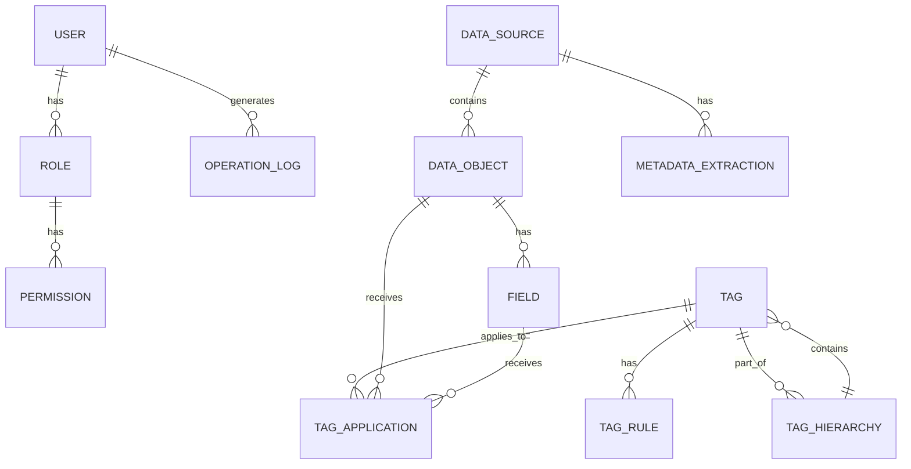
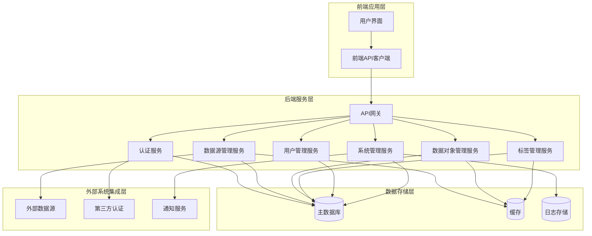

# 数据对象标签管理应用需求文档

## 1. 简介

### 1.1 文档目的
本文档旨在详细描述数据对象标签管理应用（Tag Factory）的需求规格，包括功能需求、非功能需求、数据模型、系统架构等方面，为开发团队提供明确的开发指导，确保最终交付的系统能够满足业务需求。

### 1.2 术语定义
| 术语 | 解释 |
|------|------|
| 数据源 | 提供数据的来源，如数据库、文件等 |
| 数据对象 | 数据源中的实体，如表、集合、文档等 |
| 字段 | 数据对象的属性，如列、字段等 |
| 标签 | 用于对数据对象进行分类、标记的标识符 |
| 标签规则 | 定义标签如何应用到数据对象的条件或逻辑 |
| 标签应用 | 标签与数据对象之间的关联关系 |

## 2. 产品愿景

### 2.1 核心目标
数据对象标签管理应用旨在提供一个集中化的平台，用于管理企业内部的数据源、数据对象，并通过标签机制实现对数据的分类、组织和发现，提高数据管理效率和数据利用价值。

### 2.2 业务价值
- **降低数据管理复杂度**：通过统一的平台管理分散的数据源和数据对象
- **提升数据可发现性**：通过标签机制使数据更容易被发现和访问
- **增强数据治理**：通过标准化的标签体系实现数据的规范化管理
- **支持精准数据分析**：通过标签筛选实现快速的数据定位和分析
- **促进跨部门协作**：提供统一的数据视图，打破数据孤岛
- **满足合规性要求**：通过标签记录数据的敏感级别、使用限制等信息

### 2.3 目标用户
- **数据管理员**：负责数据源配置、数据对象管理、标签体系维护
- **业务分析师**：使用标签查询和分析数据，获取业务洞察
- **开发人员**：通过API接口集成标签管理功能，开发数据应用
- **企业管理者**：查看数据资产概览，制定数据战略

## 3. 功能需求

### 3.1 数据源管理

#### 3.1.1 数据源注册
- 支持多种类型数据源的注册，包括关系型数据库、NoSQL数据库、文件系统（如Excel文档）等
- 提供数据源连接参数配置界面，如主机地址、端口、用户名、密码等
- 支持数据源测试连接功能，验证连接参数是否正确
- 支持数据源分类和分组管理

#### 3.1.3 数据源元数据提取
- 自动提取数据源中的数据对象结构信息
- 支持手动触发和定时自动提取
- 提供元数据变更历史记录

### 3.2 数据对象管理

#### 3.2.1 数据对象浏览
- 支持按数据源、分类等维度浏览数据对象
- 提供数据对象搜索和筛选功能
- 支持数据对象详情查看，包括字段信息、结构定义等

#### 3.2.2 数据对象属性管理
- 支持编辑数据对象的描述、分类等属性
- 支持数据对象版本管理
- 提供数据对象依赖关系分析

#### 3.2.3 字段管理
- 支持查看和编辑字段属性，如名称、类型、描述等
- 支持字段级别的标签应用
- 提供字段使用情况分析

### 3.3 标签管理

#### 3.3.1 标签定义
- 支持创建、编辑、删除标签
- 支持标签层级结构管理
- 支持标签分类和分组
- 提供标签描述、颜色等属性设置

#### 3.3.2 标签规则配置
- 支持基于条件的标签规则配置
- 支持规则表达式编辑和验证
- 支持规则优先级设置
- 提供规则测试和模拟功能

#### 3.3.3 标签应用
- 支持手动为数据对象应用标签
- 支持基于规则自动应用标签
- 支持批量标签应用操作
- 提供标签应用历史记录

#### 3.3.4 标签查询与分析
- 支持按标签查询数据对象
- 提供标签使用情况统计和分析
- 支持标签关联关系分析

### 3.4 用户管理

#### 3.4.1 用户认证
- 支持用户名/密码登录
- 支持第三方认证集成（如LDAP、OAuth等）
- 提供密码重置和账户锁定功能

#### 3.4.2 角色管理
- 支持自定义角色创建和管理
- 提供预设角色模板，如管理员、数据分析师、开发人员等
- 支持角色权限编辑和分配

#### 3.4.3 权限控制
- 支持基于角色的权限控制（RBAC）
- 支持细粒度的权限设置，如数据源访问权限、标签管理权限等
- 提供权限审计和日志记录

### 3.5 系统管理

#### 3.5.1 系统配置
- 支持系统参数配置，如连接池大小、超时设置等
- 提供邮件服务器配置，用于通知和告警
- 支持日志级别和存储配置

#### 3.5.2 审计日志
- 记录用户操作日志，包括登录、数据操作、标签管理等
- 提供日志查询和分析功能
- 支持日志导出和归档

#### 3.5.3 系统监控
- 提供系统运行状态监控
- 支持性能指标采集和分析
- 提供系统异常告警功能

## 4. 非功能需求

### 4.1 性能需求
- **响应时间**：系统页面加载时间不超过2秒，数据操作响应时间不超过3秒
- **处理能力**：支持同时处理100个并发用户，每天可处理10000个数据对象的标签更新
- **数据量**：支持管理1000个数据源，10000个数据对象，100000个标签

### 4.2 安全需求
- **认证**：支持多因素认证，密码复杂度要求
- **授权**：基于角色的细粒度权限控制
- **数据加密**：敏感数据传输和存储加密
- **审计**：完整的操作审计日志
- **合规性**：符合GDPR、ISO27001等安全标准

### 4.3 可用性需求
- **系统可靠性**：系统可用性达到99.9%
- **故障恢复**：支持自动故障检测和恢复
- **数据备份**：定期数据备份和恢复机制
- **容灾**：支持多节点部署和负载均衡

### 4.4 可扩展性需求
- **水平扩展**：支持集群部署，按需扩展
- **模块化设计**：系统组件松耦合，支持功能模块独立扩展
- **API设计**：提供完整的RESTful API，支持第三方集成
- **插件机制**：支持数据源类型、标签规则类型等的插件扩展

### 4.5 易用性需求
- **用户界面**：直观、简洁的用户界面，符合现代设计标准
- **操作流程**：简化操作流程，减少用户操作步骤
- **帮助文档**：提供完整的用户帮助文档和操作指南
- **错误提示**：清晰、友好的错误提示信息

### 4.6 可维护性需求
- **日志记录**：详细的系统日志和错误日志
- **监控**：系统运行状态和性能监控
- **配置管理**：集中化的配置管理
- **版本管理**：系统版本控制和升级机制

## 5. 数据模型

### 5.1 实体关系图

### 5.2 数据结构定义

#### 5.2.1 用户 (User)
- id: 唯一标识符
- username: 用户名
- password: 密码（加密存储）
- email: 电子邮件
- name: 姓名
- status: 状态（活跃/禁用）
- created_at: 创建时间
- updated_at: 更新时间

#### 5.2.2 角色 (Role)
- id: 唯一标识符
- name: 角色名称
- description: 角色描述
- created_at: 创建时间
- updated_at: 更新时间

#### 5.2.3 权限 (Permission)
- id: 唯一标识符
- name: 权限名称
- description: 权限描述
- resource_type: 资源类型
- action: 操作类型

#### 5.2.4 数据源 (DataSource)
- id: 唯一标识符
- name: 数据源名称
- type: 数据源类型（数据库/文件等）
- connection_string: 连接字符串
- status: 状态（活跃/禁用）
- description: 描述
- created_at: 创建时间
- updated_at: 更新时间

#### 5.2.5 数据对象 (DataObject)
- id: 唯一标识符
- name: 数据对象名称
- data_source_id: 所属数据源ID
- type: 数据对象类型（表/集合/文档等）
- description: 描述
- created_at: 创建时间
- updated_at: 更新时间

#### 5.2.6 字段 (Field)
- id: 唯一标识符
- name: 字段名称
- data_object_id: 所属数据对象ID
- type: 字段类型
- description: 描述
- created_at: 创建时间
- updated_at: 更新时间

#### 5.2.7 标签 (Tag)
- id: 唯一标识符
- name: 标签名称
- description: 标签描述
- color: 标签颜色
- parent_id: 父标签ID（用于层级结构）
- created_at: 创建时间
- updated_at: 更新时间

#### 5.2.8 标签规则 (TagRule)
- id: 唯一标识符
- tag_id: 关联标签ID
- name: 规则名称
- expression: 规则表达式
- priority: 优先级
- status: 状态（启用/禁用）
- created_at: 创建时间
- updated_at: 更新时间

#### 5.2.9 标签应用 (TagApplication)
- id: 唯一标识符
- tag_id: 标签ID
- target_type: 目标类型（数据对象/字段）
- target_id: 目标ID
- application_type: 应用类型（手动/自动）
- applied_by: 应用人
- applied_at: 应用时间

#### 5.2.10 操作日志 (OperationLog)
- id: 唯一标识符
- user_id: 操作用户ID
- operation_type: 操作类型
- resource_type: 资源类型
- resource_id: 资源ID
- operation_details: 操作详情
- ip_address: 操作IP地址
- created_at: 操作时间

## 6. 系统架构

### 6.1 架构概述
数据对象标签管理应用采用分层架构设计，包括前端应用层、后端服务层、数据存储层和外部系统集成层。系统采用微服务架构，各组件之间通过API进行通信，确保系统的可扩展性和可维护性。

### 6.2 组件关系图

## 7. 用户界面设计

### 7.1 设计原则
- **简洁明了**：界面设计简洁直观，减少用户认知负担
- **一致性**：保持界面元素和操作流程的一致性
- **响应式**：支持不同设备和屏幕尺寸
- **可访问性**：符合WCAG 2.1可访问性标准
- **高效操作**：优化操作流程，减少用户操作步骤

### 7.2 界面布局
- **顶部导航栏**：系统标题、用户信息、全局搜索
- **左侧菜单**：功能模块导航，如数据源管理、数据对象管理、标签管理、用户管理等
- **主内容区**：根据选择的功能模块显示相应的内容
- **右侧面板**：上下文相关的辅助信息和操作
- **底部状态栏**：系统状态、版本信息等

### 7.3 交互流程

#### 7.3.1 数据源管理流程
1. 用户登录系统
2. 进入数据源管理模块
3. 点击"添加数据源"按钮
4. 填写数据源信息并测试连接
5. 保存数据源配置
6. 系统自动提取数据源元数据
7. 用户查看提取结果

#### 7.3.2 标签管理流程
1. 用户登录系统
2. 进入标签管理模块
3. 点击"创建标签"按钮
4. 填写标签信息并保存
5. 点击"创建标签规则"按钮
6. 配置标签规则表达式
7. 测试标签规则
8. 保存标签规则
9. 系统自动应用标签到符合条件的数据对象

#### 7.3.3 数据对象查询流程
1. 用户登录系统
2. 进入数据对象管理模块
3. 使用搜索或筛选功能定位数据对象
4. 点击数据对象查看详情
5. 查看数据对象的标签信息
6. 可选择编辑数据对象属性或应用标签

## 8. 项目范围

### 8.1 范围内功能
- 数据源管理：数据源注册、监控、元数据提取
- 数据对象管理：数据对象浏览、属性管理、字段管理
- 标签管理：标签定义、规则配置、标签应用、查询与分析
- 用户管理：用户认证、角色管理、权限控制
- 系统管理：系统配置、审计日志、系统监控

### 8.2 范围外功能
- 高级数据分析：如数据挖掘、机器学习等
- 数据可视化：如报表生成、仪表盘等
- 数据处理：如数据转换、ETL等
- 实时数据处理：如流数据处理等
- 数据质量监控：如数据完整性、准确性检查等

## 9. 验收标准

1. **功能完整性**：所有范围内功能均已实现，满足需求文档中的功能描述
2. **性能指标**：系统响应时间、处理能力等性能指标符合非功能需求
3. **安全性**：系统通过安全测试，无严重安全漏洞
4. **可用性**：系统运行稳定，可用性达到99.9%
5. **可扩展性**：系统支持水平扩展，能够应对业务增长
6. **易用性**：用户界面友好，操作流程简洁，用户满意度达到85%以上
7. **可维护性**：系统日志完整，监控有效，配置管理集中化

## 10. 风险与依赖

### 10.1 风险
- **数据源连接风险**：不同类型数据源的连接稳定性和兼容性
- **性能风险**：大量数据对象和标签的管理可能导致系统性能下降
- **安全风险**：敏感数据的访问控制和保护
- **集成风险**：与第三方系统的集成可能存在兼容性问题

### 10.2 依赖
- **技术依赖**：需要依赖数据库、缓存、消息队列等技术组件
- **外部系统依赖**：需要与外部数据源、认证系统等集成
- **人员依赖**：需要具备数据管理、系统架构等专业知识的人员
- **资源依赖**：需要足够的服务器资源和网络带宽

---

**文档版本**：1.0
**编写日期**：2026-02-02
**审核人员**：_________________
**批准人员**：_________________