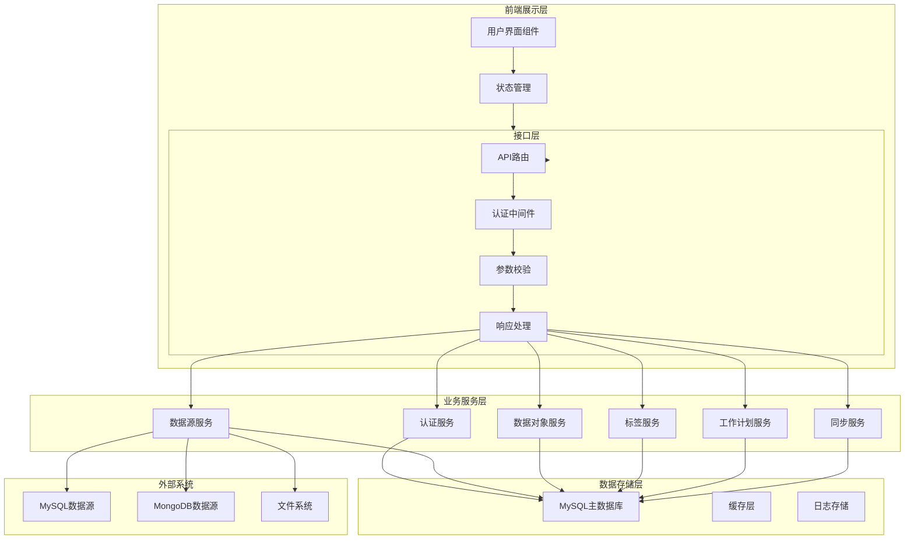
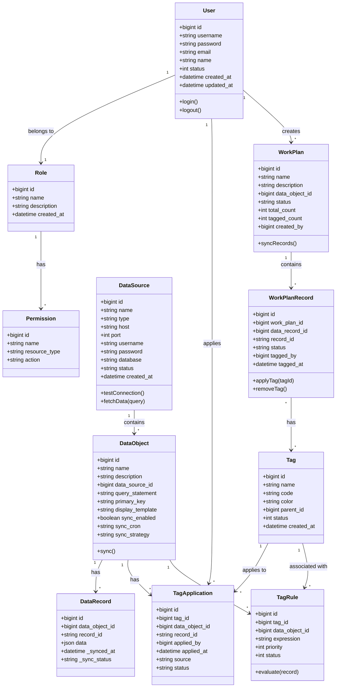
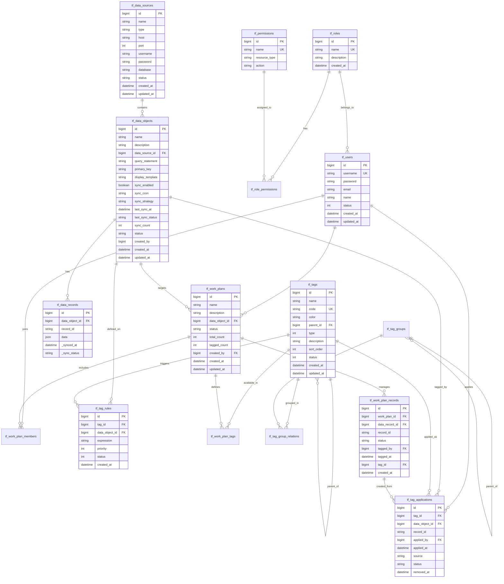
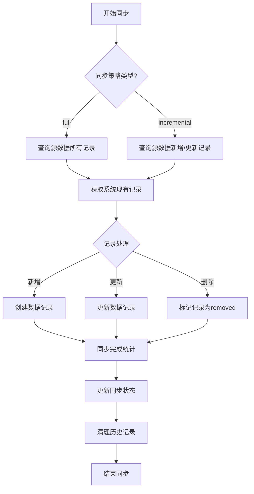
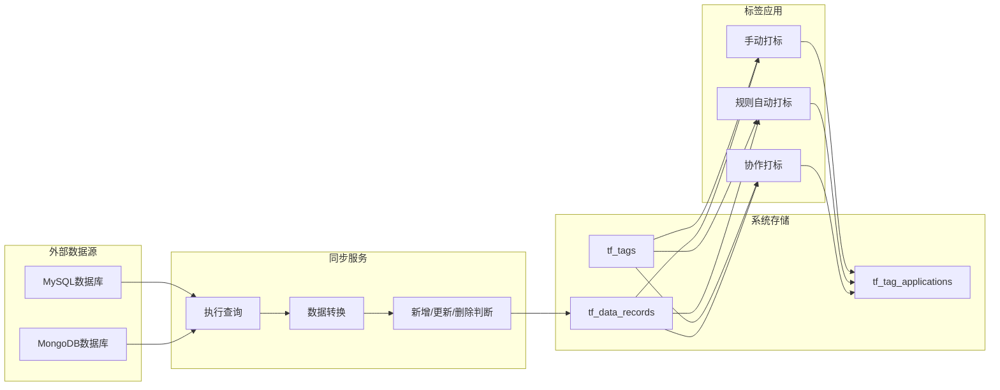

# 数据对象标签管理应用开发文档

## 文档信息

| 项目 | 内容 |
|------|------|
| 项目名称 | Tag Factory（数据对象标签管理应用） |
| 文档版本 | 2.2 |
| 编写日期 | 2026-02-18 |
| 技术栈 | Next.js 16 + Ant Design 6 + Node.js + MySQL |
| 文档状态 | 正式发布 |

## 第一章 项目概述与设计理念

### 1.1 项目背景与核心价值

数据对象标签管理应用（Tag Factory）旨在为企业提供一个集中化的数据资产管理平台。随着企业数字化转型的深入推进，内部数据源日益分散，数据格式日趋多样化，传统的数据管理方式已无法满足企业对数据治理、数据分析和数据协作的迫切需求。Tag Factory 通过统一的标签管理体系，将分散的数据源、数据对象有机地组织起来，通过标签机制实现对数据的精准分类、智能发现和协作打标，从而显著提升企业的数据管理效率和数据资产价值。

本项目的核心价值体现在以下几个维度：首先，Tag Factory 提供了一站式的数据源管理能力，支持关系型数据库、NoSQL 数据库、文件系统等多种数据源的统一接入和元数据提取，打破了传统的数据孤岛格局；其次，系统独创的标签规则引擎能够基于数据特征自动应用标签，大幅降低人工打标的工作量；再次，工作计划模块支持多成员协作打标，为企业提供了灵活的标签任务管理机制；最后，完整的标签查询和分析功能帮助用户快速定位所需数据，支撑精准的数据分析和业务决策。

### 1.2 设计原则

本项目在架构设计和代码实现过程中严格遵循以下核心设计原则，这些原则贯穿于项目的每一个模块和每一行代码，确保系统具备良好的可维护性、可扩展性和可测试性。

**模块化设计原则**要求系统各功能模块之间保持松耦合状态，每个模块职责单一、边界清晰。数据源管理、数据对象管理、标签管理、工作计划管理等核心功能模块相互独立，通过标准化的接口进行通信。这种设计使得系统可以根据业务需求灵活地增删功能模块，同时便于团队并行开发和代码复用。例如，数据同步功能被封装为独立的服务模块，不仅可以被数据对象管理模块调用，还可以被工作计划模块复用，实现记录数据的自动同步。

**API 优先原则**强调前后端分离架构下接口设计的重要性。所有业务功能均通过 RESTful API 对外暴露，前端页面不直接访问数据库或业务逻辑层。API 设计遵循资源导向原则，使用规范 HTTP 方法（GET、POST、PUT、DELETE）和标准的状态码（200、201、400、401、403、404、500），确保接口语义清晰、易于理解和使用。同时，每个 API 接口都包含完善的请求参数校验、错误处理和响应格式规范，为前端开发和第三方集成提供可靠的基础。

**渐进式增强原则**关注用户体验的系统性和连贯性。系统支持用户从基础功能逐步过渡到高级功能，学习曲线平缓。基础版本提供用户认证、数据源管理、标签管理等核心功能，高级版本逐步开放标签规则引擎、工作计划协作、标签分析等进阶特性。用户可以根据实际业务需求选择性地使用相关功能，避免功能过载带来的认知负担。

**数据一致性原则**确保系统在各种异常情况下都能维护数据的完整性和准确性。所有涉及多表操作的业务流程均采用数据库事务机制，保证操作的原子性。标签应用、工作计划打标等关键操作都记录完整的操作日志，支持数据追溯和异常恢复。系统还提供了数据同步的冲突处理机制，当源数据发生变化时能够智能地处理新增、更新和删除操作。

### 1.3 术语定义

为确保文档描述的准确性和一致性，本节对项目中使用的核心术语进行统一定义。这些术语贯穿于需求分析、设计、开发和测试的各个阶段，是团队成员沟通的共同语言。

| 术语 | 定义 |
|------|------|
| 数据源 | 提供数据的外部系统或存储介质，包括 MySQL、MongoDB 等关系型和文档型数据库，以及 Excel、CSV 等文件系统。数据源是系统获取原始数据的入口，每个数据源包含连接配置、认证信息等元数据。 |
| 数据对象 | 从外部数据源同步到系统中的结构化数据集，包含数据的查询定义、主键配置、显示模板等元信息。数据对象是数据管理的核心实体，关联数据源、数据记录和标签应用等多个业务实体。 |
| 数据记录 | 数据对象中的具体数据行，每条记录包含完整的原始数据内容和系统元信息（如同步时间、同步状态）。记录是标签应用的最小粒度，支持对象级和记录级两种标签应用模式。 |
| 标签 | 用于标识和分类数据的元数据元素，具有名称、编码、颜色、类型等属性。标签支持层级结构，可以形成树形的分类体系。标签通过标签应用实体与数据对象或记录建立关联关系。 |
| 标签规则 | 定义标签自动应用逻辑的条件表达式，基于数据记录的字段值自动判断是否应关联特定标签。规则引擎支持复杂的多条件组合和优先级控制。 |
| 标签应用 | 标签与数据对象或记录之间的关联关系实体，记录标签的关联时间、应用来源（手动/自动/导入）、操作人等信息。标签应用支持软删除，保留历史记录便于追溯。 |
| 工作计划 | 针对特定数据对象和标签集合的协作打标任务单元，包含参与成员、可用标签集合、进度追踪等协作管理功能。工作计划实现了标签任务的分配、执行和验收闭环。 |
| 工作计划记录 | 工作计划关联的具体数据记录及其打标状态，记录每个记录的当前标签、标记人、标记时间等信息。工作计划记录是协作打标的核心数据实体。 |

## 第二章 系统架构设计

### 2.1 整体架构概览

Tag Factory 采用现代化的分层微服务架构设计理念，虽然整体部署为单体应用，但在架构设计上遵循微服务的模块化思想，各功能模块职责清晰、边界明确。系统自下而上划分为数据存储层、业务服务层、接口层和前端展示层四个核心层次，每个层次都有明确的责任边界和标准化接口。

数据存储层负责所有数据的持久化存储，采用 MySQL 作为主数据库存储业务数据，数据库表名统一使用 `tf_` 前缀（Tag Factory 缩写）以避免命名冲突。该层还包括数据库连接池管理、事务控制、读写分离等基础设施功能。业务服务层封装了所有的业务逻辑，包括用户认证、数据源管理、数据对象管理、标签管理、工作计划管理等核心服务模块。每个服务模块都包含数据验证、业务规则处理、数据转换等逻辑，是系统最核心的代码区域。接口层基于 Next.js App Router 实现 RESTful API，负责请求路由、参数校验、认证授权、响应格式化等横切关注点的处理。前端展示层使用 React 组件实现用户界面，通过 Ant Design 组件库提供一致的视觉体验和交互模式。



### 2.2 技术选型依据

本节详细阐述项目各核心技术选型的决策依据，帮助团队成员理解技术选择的背景和考量因素，在后续开发和维护过程中做出合理的技术决策。

**前端框架选择 Next.js 16** 是经过充分评估后的决策。Next.js 提供了服务器端渲染（SSR）和静态站点生成（SSG）能力，对于企业内部管理系统而言，首屏加载性能和 SEO 优化虽然不是核心诉求，但 SSR 带来的更好用户体验和更快的首屏显示仍然具有显著价值。App Router 架构提供了更灵活的路由组织和布局管理机制，Server Components 允许在服务器端渲染组件，减少客户端 JavaScript 包体积，提高页面加载速度。Next.js 生态系统成熟，社区活跃，文档完善，便于团队快速上手和问题解决。此外，Next.js 内置的 API 路由功能使得前后端可以在同一项目中统一管理，简化了开发和部署流程。

**UI 框架选择 Ant Design 6** 符合企业级中后台应用的设计需求。Ant Design 提供了丰富的组件库，涵盖表单、表格、弹窗、导航等常用场景，组件设计遵循统一的设计规范，视觉风格一致，用户学习成本低。Ant Design 6 在性能、主题定制、无障碍访问等方面都有显著提升，支持 CSS-in-JS 方案实现动态主题切换。对于企业内部管理系统而言，Ant Design 的专业设计和丰富组件能够大幅提升开发效率，同时保证界面质量和用户体验。项目中已集成了 `@ant-design/icons` 图标库和 `antd` 组件库，通过 `ConfigProvider` 实现全局主题配置。

**后端语言选择 Node.js** 是基于团队技术栈统一性和开发效率的考量。Node.js 的事件驱动、非阻塞 I/O 模型特别适合 I/O 密集型的数据管理应用，能够高效处理数据库查询、外部数据源连接等操作。JavaScript/TypeScript 语言一致性使得前后端代码可以共享类型定义和工具函数，减少重复劳动。Sequelize 作为成熟的 ORM 框架，提供了优雅的数据库抽象，支持多种数据库ialect，包括 MySQL、MariaDB、PostgreSQL 等。项目中已配置 mysql2 驱动程序和 sequelize ORM，能够满足复杂的业务数据操作需求。

**数据库选择 MySQL** 是基于系统特性和成本效益的综合评估。Tag Factory 作为企业级数据管理应用，数据模型相对固定，事务一致性要求高，MySQL 的 ACID 特性能够很好地满足这些需求。MySQL 生态系统成熟，运维工具丰富，团队运维经验丰富，能够有效控制运维成本。项目中还配置了 MongoDB 连接支持，用于处理复杂嵌套数据的场景，如原始数据存储和标签规则条件表达式等。MongoDB 的文档模型灵活度高，适合存储结构不固定的数据记录。

**认证方案选择 JWT** 平衡了安全性和开发复杂度。JWT（JSON Web Token）是无状态的认证方案，服务端不需要维护会话信息，便于水平扩展和分布式部署。JWT 包含用户身份信息和过期时间，配合签名机制能够有效防止身份伪造。项目中使用 `jsonwebtoken` 库生成和验证 Token，使用 `bcrypt` 库对用户密码进行哈希加密存储，确保密码安全性。认证中间件实现请求拦截和 Token 验证，保护需要认证的 API 路由。

### 2.3 核心模块架构

本节详细描述系统各核心功能模块的架构设计，包括模块职责划分、核心类设计、模块间依赖关系等内容，帮助开发人员深入理解系统的内部结构和实现机制。

**认证服务模块**负责用户身份验证和访问控制，是系统安全的第一道防线。该模块包含用户登录、登出、Token 刷新、密码重置、账户锁定等核心功能。认证服务采用 JWT 实现无状态认证，Token 中包含用户 ID、角色信息、过期时间等关键数据。模块设计遵循安全最佳实践，密码存储使用 bcrypt 哈希算法，Token 签名使用 HS256 对称加密算法，支持 Token 黑名单机制实现主动登出功能。认证中间件作为横切关注点，通过 Next.js Middleware 机制拦截请求，实现全局的访问控制。

**数据源管理模块**负责外部数据源的注册、配置、连接测试和状态监控。该模块支持 MySQL 和 MongoDB 两种主要数据源类型，每种类型有独立的连接参数配置和连接验证逻辑。数据源连接采用动态创建方式，每次查询时创建独立连接，查询完成后立即释放，避免连接泄漏。模块还提供了连接池管理的基础设施，虽然当前版本的同步任务频率较低，但预留了连接池扩展能力。数据源测试连接功能通过独立的连接验证接口实现，支持在数据源创建前验证连接参数的正确性。

**数据对象管理模块**是系统的核心业务模块，负责数据对象的定义、创建、查询和同步管理。该模块关联数据源、数据记录和标签应用三个核心实体，实现从外部数据源到系统内部存储的完整数据流转。数据对象支持灵活的显示模板配置，使用 `{{field}}` 语法定义记录的展示格式，模板解析器支持嵌套字段路径（如 `{{user.name}}`）和条件渲染。同步服务模块提供手动触发和定时同步两种模式，支持全量和增量同步策略。同步过程中实现了新增、更新、删除的智能判断，确保系统数据与源数据的一致性。

**标签管理模块**负责标签的定义、层级结构管理和标签应用控制。标签支持树形层级结构，父标签和子标签通过 `parent_id` 外键关联，支持无限层级的标签分类。标签应用采用桥接表设计，通过 `tf_tag_applications` 表记录标签与数据对象或记录的关联关系，支持对象级标签（record_id 为空）和记录级标签两种模式。标签模块还包含标签分组功能，通过 `tf_tag_groups` 和 `tf_tag_group_relations` 表实现多对多的标签分组关系。

**标签规则模块**实现标签的自动应用逻辑，支持基于条件的自动打标功能。规则引擎解析用户定义的规则表达式，匹配数据记录的字段值，自动触发标签应用。规则定义包含规则名称、关联标签、条件表达式、优先级等属性，条件表达式支持简单比较（如 `age > 18`）和复杂组合（如 `age > 18 AND gender = 'male'`）。规则测试功能允许用户在规则正式生效前，使用测试数据验证规则的匹配效果，避免错误规则导致批量误打标。

**工作计划模块**是系统的协作打标核心，支持多成员协作完成标签任务。工作计划关联特定的数据对象和预设标签集合，参与成员可以在工作计划范围内对数据记录进行打标操作。工作计划记录（`tf_work_plan_records`）表存储每个数据记录在工作计划中的打标状态和标签信息，支持待打标（pending）、已打标（tagged）、已跳过（skipped）三种状态。工作计划进度追踪功能实时统计已打标记录数和完成百分比，成员贡献统计记录每个参与者的打标数量，便于工作评估和绩效考核。



### 2.4 模块依赖关系

系统各模块之间存在清晰的依赖关系，理解这些依赖关系对于代码维护和功能扩展至关重要。整体而言，模块依赖呈现自上而下的层级结构，上层模块依赖下层模块提供的服务，下层模块不依赖上层模块。

认证服务模块是其他所有业务模块的基础，所有需要用户认证的 API 路由都依赖认证中间件提供的用户身份信息。数据源管理模块是数据对象管理模块的前提，数据对象必须关联已注册的数据源才能创建。数据对象管理模块是标签应用和工作计划模块的前提，数据记录是标签应用和工作计划记录的关联基础。标签管理模块被数据对象管理、标签规则和工作计划三个模块共同依赖，是系统标签体系的核心。

模块间的依赖通过标准化的接口进行抽象，下层模块通过 exports 暴露明确的接口契约，上层模块通过 imports 依赖这些接口而非具体实现。这种设计使得模块内部实现可以独立演进，只要接口保持兼容，就不会影响依赖模块的正常工作。

## 第三章 数据模型设计

### 3.1 数据库整体设计

Tag Factory 的数据模型设计遵循规范化设计原则，通过合理的外键约束和索引设计确保数据完整性和查询性能。数据库使用 MySQL 8.0 版本，所有表名统一采用 `tf_` 前缀（Tag Factory 缩写），字段名使用小写下划线命名法（snake_case），与 Sequelize 模型定义保持一致。

数据库整体设计包含用户与权限、数据源与数据对象、标签体系、工作计划四大核心领域，共计 17 张核心数据表。用户与权限领域包括用户表、角色表、权限表、角色权限关联表四张表，实现基于角色的访问控制（RBAC）。数据源与数据对象领域包括数据源表、数据对象表、数据记录表、标签应用表四张表，实现外部数据源的接入管理和数据对象的标签关联。标签体系包括标签表、标签分组表、标签分组关联表、标签规则表四张表，实现灵活的标签定义和自动打标规则。工作计划包括工作计划表、工作计划标签表、工作计划成员表、工作计划记录表四张表，实现协作打标的任务管理。



### 3.2 核心表结构设计

本节详细描述各核心数据表的字段定义、数据类型、约束条件以及设计考量，帮助开发人员深入理解数据模型的设计意图。

**用户表（tf_users）** 存储系统用户的基本信息和认证数据。`id` 字段使用 BIGINT 自增类型作为主键，支持大规模用户场景。`username` 字段设置唯一约束，确保用户名不重复。`password` 字段存储 bcrypt 哈希后的密码原文，绝不存储明文密码。`status` 字段标识用户账户状态，1 表示活跃，0 表示禁用，与账户锁定机制配合实现安全控制。`email` 字段用于密码重置和系统通知功能。表设计预留了第三方认证集成的扩展字段位置，如 `oauth_provider`、`oauth_id` 等。

**数据源表（tf_data_sources）** 存储外部数据源的连接配置和元信息。`type` 字段标识数据源类型，当前支持 `mysql` 和 `mongodb` 两种类型。`host`、`port`、`username`、`password`、`database` 字段组合构成完整的连接配置，密码字段加密存储。`status` 字段标识数据源连接状态，支持连接失败后的禁用管理。`created_at` 和 `updated_at` 字段记录数据源的创建和更新时间，便于审计追踪。

**数据对象表（tf_data_objects）** 是数据模型的核心实体，关联数据源、数据记录和标签应用。`data_source_id` 外键关联数据源表，建立数据对象与数据源的所属关系。`query_statement` 字段存储 SQL 查询语句或 MongoDB 聚合管道，用于从外部数据源获取数据。`primary_key` 字段指定源数据的主键字段名，用于同步时的增量判断和记录唯一性标识。`display_template` 字段存储记录显示模板，支持 `{{field}}` 语法定义展示格式。`sync_enabled`、`sync_cron`、`sync_strategy` 字段组合控制自动同步策略，支持定时全量或增量同步。

**数据记录表（tf_data_records）** 存储从外部数据源同步的具体数据。`data_object_id` 和 `record_id` 组合构成复合唯一键，标识特定数据对象下的唯一记录。`data` 字段使用 JSON 类型存储完整的原始数据，支持灵活的字段结构。`_synced_at` 字段记录最近一次同步时间，`_sync_status` 字段标记记录状态，`active` 表示正常同步的记录，`removed` 表示已被源数据删除的记录，保留便于同步时判断删除操作。

**标签表（tf_tags）** 存储标签的定义和属性。`code` 字段作为标签的业务编码具有唯一性，用于系统内部引用标签。`parent_id` 字段支持自引用外键，实现标签的树形层级结构。`type` 字段区分标签类型，`color` 字段存储标签的视觉颜色，`sort_order` 字段控制标签的排序顺序。`status` 字段控制标签是否可用，禁用的标签不影响历史关联但不再支持新关联。

**标签应用表（tf_tag_applications）** 是标签与数据对象或记录之间的桥接实体。`tag_id`、`data_object_id`、`record_id` 组合构成唯一约束，确保同一标签在同一记录上不重复应用。`applied_by` 字段记录打标操作人，`applied_at` 记录打标时间，`source` 字段区分标签来源（`manual` 手动、`auto` 规则自动、`import` 批量导入）。`status` 字段支持软删除，移除标签时更新状态而非物理删除，保留操作历史便于追溯。

**工作计划表（tf_work_plans）** 管理协作打标任务的整体信息。`data_object_id` 字段关联任务目标数据对象，`status` 字段控制任务状态（`active` 进行中、`completed` 已完成、`archived` 已归档）。`total_count` 和 `tagged_count` 字段组合计算任务完成进度，实时更新支撑进度追踪功能。`created_by` 字段记录任务创建人。

**工作计划记录表（tf_work_plan_records）** 存储工作计划中每个数据记录的打标状态。`status` 字段支持 `pending` 待打标、`tagged` 已打标、`skipped` 已跳过三种状态。`tagged_by` 和 `tagged_at` 字段记录打标人和打标时间，`tag_id` 字段记录应用的标签。同一数据记录在同一工作计划中只能关联一个标签，但可以由不同成员分步骤打标。

### 3.3 索引设计策略

合理的索引设计是保证系统查询性能的关键。本节描述各表的索引策略和设计考量，帮助数据库管理员理解和优化索引配置。

数据对象表的 `data_source_id` 字段建立普通索引，支撑按数据源筛选数据对象的查询场景。状态相关字段（`status`、`sync_enabled`）建立复合索引，优化按状态筛选的查询性能。创建时间字段的索引支持按时间排序和分页查询。标签应用表在 `tag_id`、`data_object_id`、`record_id` 三个字段上分别建立索引，优化按标签查询、按对象查询、按记录查询的各类场景。复合索引设计考虑了最左前缀原则，优先包含等值判断字段再包含范围查询字段。

工作计划表的 `data_object_id` 和 `created_by` 字段分别建立索引，优化按数据对象查询任务列表和按创建人查询的常见场景。状态字段的索引支持任务状态筛选。工作计划记录表在 `work_plan_id` 和 `status` 字段上建立复合索引，优化工作计划详情页的待打标/已打标记录列表查询。

## 第四章 核心功能模块实现方案

### 4.1 用户认证模块

用户认证模块是系统安全的基础，提供了完整的身份验证和访问控制功能。该模块实现用户登录、会话管理、密码加密、Token 生成与验证、访问控制等核心功能，采用 JWT 实现无状态认证，兼顾安全性和可扩展性。

**登录流程设计**遵循安全最佳实践，用户提交用户名和密码后，系统首先查询用户是否存在并验证账户状态，然后使用 bcrypt 比较密码哈希，最后生成 JWT Token 返回给客户端。Token 包含用户 ID、角色信息、过期时间等关键数据，签名密钥存储在环境变量中，绝不在代码或配置文件中硬编码。登录成功后，Token 通过 HttpOnly Cookie 发送给客户端，客户端后续请求自动携带该 Cookie，服务端中间件解析 Cookie 获取用户身份。

**密码存储方案**采用 bcrypt 哈希算法，设置合理的 cost factor（默认为 10）平衡安全性和性能。密码绝不以明文形式存储或传输，数据库中存储的是 bcrypt 哈希值。密码重置功能通过发送重置链接到用户邮箱实现，重置链接包含一次性 Token，Token 过期时间设置为 1 小时，确保安全性同时提供合理的操作窗口。

**访问控制机制**基于 Next.js Middleware 实现全局请求拦截。Middleware 解析请求中的认证 Cookie，验证 Token 签名和过期时间，从 Token 中提取用户信息并注入请求上下文。公开路由（如登录页、静态资源）不需要认证，Middleware 放行这些请求。受保护的 API 路由通过装饰器或工具函数检查用户认证状态，未认证请求返回 401 错误。角色权限控制在业务层实现，通过用户角色关联的权限列表判断是否允许访问特定资源。

### 4.2 数据源管理模块

数据源管理模块负责外部数据源的注册、配置、连接测试和状态监控。该模块支持 MySQL 和 MongoDB 两种主要数据源类型，通过统一的接口封装差异化的连接逻辑，为上层模块提供透明的数据访问能力。

**数据源注册流程**引导用户配置数据源的基本信息和连接参数。系统提供表单化的配置界面，MySQL 类型需要填写主机地址、端口号、用户名、密码、数据库名称等参数，MongoDB 类型额外需要认证数据库（authSource）配置。提交前系统调用测试连接接口验证参数正确性，连接成功后才保存数据源配置。测试连接功能创建独立的数据库连接进行验证，验证完成后立即关闭连接，不保留连接状态。

**数据源连接管理**采用按需创建、独立使用的策略。同步服务或预览查询需要访问数据源时，根据数据源 ID 查询数据源配置，然后创建独立的数据库连接执行查询，查询完成后立即释放连接。这种设计避免了连接泄漏问题，但每次查询都有连接建立的开销。对于高频率的同步任务，可以考虑引入连接池优化，但当前版本的同步频率较低，暂不需要此优化。

**数据源元数据提取**在数据对象创建阶段触发。用户选择已注册的数据源后，系统调用预览查询接口执行配置的可选查询语句或默认查询，返回少量示例数据用于字段选择和显示模板配置。预览功能返回的数据用于字段智能提示和模板预览，不存储元数据。数据源的表结构、字段列表等元数据在数据对象创建时通过查询语句间接获取，不单独存储。

### 4.3 数据对象管理模块

数据对象管理模块是系统的核心业务模块，负责数据对象的定义、创建、查询、显示模板配置和同步管理。该模块将外部数据源的数据同步到系统统一存储，为标签应用和工作计划提供数据基础。

**数据对象创建流程**包含五个关键步骤：第一步选择已注册的数据源；第二步配置查询语句（SQL 或 MongoDB 聚合管道），用于从数据源获取数据；第三步指定源数据的主键字段，用于记录唯一性标识和增量同步判断；第四步配置显示模板，使用 `{{field}}` 语法定义记录的展示格式；第五步配置同步策略，包括是否启用自动同步、CRON 表达式、同步策略（full/incremental）。创建完成后系统返回数据对象 ID，前端跳转到详情页或记录列表页。

**显示模板引擎**是数据对象模块的核心功能组件。模板解析器使用正则表达式 `/\{\{([^}]+)\}\}/g` 匹配模板中的占位符，支持单级字段（如 `{{name}}`）和多级嵌套字段（如 `{{user.name}}`）两种格式。模板渲染时，占位符被替换为数据记录中对应字段的值，嵌套字段通过路径遍历获取值（如 `data.user.name`）。模板解析器还提供字段提取、模板验证、预览渲染等辅助功能，支撑创建向导中的字段选择和预览展示功能。

**数据同步服务**是数据对象管理的重要组成部分，负责将外部数据源的数据同步到系统统一存储表。同步服务支持手动触发和定时触发两种模式，支持全量同步和增量同步两种策略。全量同步每次同步都重新获取源数据的所有记录，更新现有记录、删除不存在的记录、添加新记录。增量同步基于主键和同步时间戳判断新增和更新，跳过未变化的记录以提高效率。同步结果记录在数据对象表的 `last_sync_at`、`last_sync_status`、`sync_count` 字段中，便于状态监控和问题排查。



### 4.4 标签管理模块

标签管理模块负责标签的定义、层级结构管理和标签应用控制。该模块提供灵活的标签体系和多种标签应用模式，支撑数据分类、组织和发现等核心业务场景。

**标签层级结构**通过 `parent_id` 自引用外键实现。每个标签可以指定父标签，形成树形的标签分类体系。根标签的 `parent_id` 为空值，层级深度通过递归查询计算。标签列表接口支持树形结构返回，前端使用 Tree 组件展示标签层级，支持展开/折叠、拖拽排序等交互操作。标签层级没有深度限制，可以根据业务需求组织任意层级的分类结构。

**标签分组功能**提供了多对多的标签组织机制。标签分组表（`tf_tag_groups`）存储分组的基本信息，分组关联表（`tf_tag_group_relations`）记录标签与分组的对应关系。同一标签可以属于多个分组，分组内的标签通过关联表记录，分组本身不存储标签列表。这种设计支持灵活的标签组织方式，同一标签可以按业务维度（如「高价值客户」）和属性维度（如「VIP 标签」）等多种分类方式组织。

**标签应用模式**支持对象级和记录级两种粒度。对象级标签应用于数据对象整体，`record_id` 字段为空值，表示标签关联到对象及其所有记录。记录级标签应用于特定数据记录，`record_id` 字段填充记录主键值，表示标签仅关联到该记录。两种模式可以同时存在，一个数据对象可以有对象级标签（影响所有记录），每条记录又可以有独立的记录级标签。标签应用采用软删除机制，`status` 字段记录关联状态，`removed_at` 记录移除时间，保留历史便于追溯。

### 4.5 标签规则模块

标签规则模块实现标签的自动应用逻辑，支持基于条件的批量打标功能。该模块通过规则引擎解析用户定义的表达式，自动匹配数据记录并应用相应标签，显著提升打标效率。

**规则定义结构**包含规则名称、关联标签、条件表达式、优先级、状态等属性。条件表达式使用类 SQL 语法，支持字段引用、常量比较、逻辑运算符等元素。例如，表达式 `age > 18 AND gender = 'male'` 表示匹配年龄大于 18 且性别为男性的记录。表达式解析器将用户输入的表达式转换为可执行的函数或查询条件，在同步记录或手动触发时进行匹配判断。

**规则执行机制**在数据同步和手动触发两种场景下工作。数据同步时，对于每条新增或更新的记录，系统遍历该数据对象关联的所有规则，使用记录数据执行条件判断，匹配成功的规则自动应用对应标签。手动触发时，用户选择一个或多个规则，系统对目标范围内（数据对象或记录筛选）的数据执行规则匹配，应用匹配成功的标签。规则测试功能允许用户使用示例数据验证规则效果，在正式生效前发现和修正错误。

**规则优先级**控制多个规则同时匹配时的标签应用顺序。优先级数值越小表示优先级越高，高优先级规则先执行。规则执行结果可以累加（多条规则匹配则应用多个标签），也可以互斥（高优先级规则匹配后跳过低优先级），具体行为根据业务需求配置。优先级机制在复杂业务场景下尤为重要，例如「VIP 客户」标签优先级高于「普通客户」标签，避免同一记录被错误地打上低优先级标签。

### 4.6 工作计划模块

工作计划模块是系统的协作打标核心，支持多成员协作完成标签任务。该模块通过工作计划实体关联数据对象、可用标签和参与成员，提供任务分配、执行、验收的完整工作流。

**工作计划创建流程**引导用户配置任务的基本信息和协作参数。第一步输入工作计划名称和描述；第二步选择关联的数据对象，任务将基于该数据对象的记录进行打标；第三步配置可用标签集合，参与成员只能从这些预设标签中选择；第四步添加参与成员并设置角色（owner/member），owner 拥有管理权限（修改配置、结束任务），member 只有执行权限（打标、查看）。创建时系统自动同步数据对象的记录到工作计划，初始化工作计划记录表的待打标状态记录。

**任务执行交互**在任务详情页的「任务执行」Tab 中进行。待打标列表展示未打标的记录列表，参与者点击记录查看详情，从可用标签中选择标签完成打标。已打标列表展示已打标的记录列表，显示当前标签和应用人。参与者只能移除自己打的标签，不能移除他人打的标签。批量打标功能支持选择多条记录同时应用同一标签，提高大数量场景下的操作效率。每次打标操作都更新工作计划记录的状态和关联标签，实时计算并更新工作计划表的 `tagged_count` 字段。

**进度追踪功能**实时计算和展示任务完成情况。进度百分比 = `tagged_count / total_count * 100%`，通过工作计划表的相关字段计算。成员贡献统计查询工作计划成员表和打标记录，计算每个成员的 `contribution_count`（打标数量）和 `contribution_percentage`（贡献占比），支持任务评估和绩效考核。任务状态支持手动结束或归档（owner 操作），结束后参与者不能再进行打标操作，但可以继续查看任务详情和历史记录。

### 4.7 AI智能批量打标模块

AI智能批量打标模块是Tag Factory的效率提升核心功能，基于OpenAI API实现自然语言驱动的智能打标。该模块集成OpenAI的GPT模型，允许用户通过自然语言提示词描述打标规则，AI自动分析数据记录并推荐合适的标签。

**模块架构设计**采用三层架构：接口层负责接收前端请求并返回处理结果；服务层封装OpenAI API调用、打标逻辑处理和结果解析；数据层管理AI配置、打标任务和提示词模板的持久化。模块与工作计划模块紧密集成，在工作计划的任务执行界面提供AI打标入口。

**OpenAI API集成**是模块的核心能力。系统通过官方OpenAI Node.js客户端库调用API，支持GPT-4o、GPT-4-turbo等主流模型。API Key通过环境变量或配置文件存储（OPENAI_API_KEY），不在数据库中存储。服务层实现请求重试机制（最多3次），处理API限流和临时错误。系统记录每次API调用的日志，包括请求时间、消耗tokens、响应状态等信息，便于成本核算和问题排查。

**分页输入设计**解决大批量数据打标的挑战。系统将待打标记录分批输入大模型，每次处理的记录数量可配置（默认50条/页，建议范围10-100条）。分页大小由用户在打标操作时设置。分页处理流程：1）根据page_size将记录分成多批；2）每批记录构建提示词发送给AI；3）收集所有批次的推荐结果；4）合并结果后返回给用户预览或执行。这种设计避免单次请求数据量过大导致API拒绝，同时通过减少API调用次数降低成本。

**批量打标流程**分为预览和执行两个阶段。预览阶段用户输入打标提示词并选择目标记录范围，系统调用AI分析每批记录并返回推荐的标签，但不写入数据库。用户可以在预览界面查看推荐结果，确认无误后点击执行。执行阶段系统遍历预览结果，调用现有的批量打标接口将标签写入数据库，同时更新工作计划记录状态和统计数据。系统支持异步处理大量记录，通过消息队列或后台任务避免API超时。

**打标提示词模板**功能帮助用户复用有效的提示词。系统预置几种常见场景的模板（如数值范围分类、文本情感判断、类别匹配等），用户也可以创建自定义模板。模板支持变量占位符，如`{{field_name}}`表示动态字段名，便于在不同数据对象间复用。模板使用次数统计帮助识别高频模板。

**AI配置管理**提供灵活的参数控制。AI相关配置（API Key、模型、调用参数）通过环境变量或配置文件进行管理，配置项包括：AI模型选择（OPENAI_MODEL）、temperature参数（OPENAI_TEMPERATURE）、max_tokens限制（OPENAI_MAX_TOKENS）等。每页记录数（page_size）在打标操作时由用户在页面上设置。

**结果审核功能**确保打标质量。每次AI打标任务生成详细的结果报告，包括处理记录数、成功数、失败数、各标签分布等。用户可以查看具体每条记录的AI推荐结果和实际应用结果，支持筛选和导出。对于错误的打标结果，支持批量撤销操作，将记录恢复为待打标状态。

## 第五章 数据流程设计

### 5.1 整体数据流转

Tag Factory 的数据流转涉及从外部数据源到系统内部存储、从系统存储到标签应用和工作计划两个主要方向。理解整体数据流转有助于开发人员把握系统边界和模块协作关系。

外部数据源数据经过数据同步服务流入系统统一存储表。同步服务根据数据对象的查询语句从外部数据源获取数据，经过数据格式转换后存储到 `tf_data_records` 表中。同步服务还负责维护记录的新增、更新、删除判断，确保系统数据与源数据的一致性。存储在系统中的数据记录是标签应用和工作计划的关联基础，标签应用记录关联到 `tf_data_records` 表的特定记录或关联到数据对象整体。

标签数据从标签定义流向数据记录。标签表（`tf_tags`）存储标签定义，标签应用表（`tf_tag_applications`）记录标签与数据对象或记录的关联关系。标签可以通过手动方式应用（用户在前端界面操作），也可以通过规则引擎自动应用（满足规则条件时自动打标）。工作计划模块复用了标签应用的数据结构，工作计划记录（`tf_work_plan_records`）关联到特定的数据记录和标签，形成协作打标的完整闭环。



### 5.2 数据同步流程

数据同步是系统数据流转的核心环节，涉及外部数据源查询、系统现有数据对比、新增更新删除处理、同步状态更新等多个步骤。本节详细描述同步流程的各个环节和关键处理逻辑。

**同步触发**支持手动触发和定时触发两种方式。手动触发通过 API 接口 `/api/data-objects/[id]/sync-records` 实现，管理员可以在数据对象详情页或通过管理工具手动启动同步。定时触发依赖外部任务调度系统（如操作系统 crond 或 Kubernetes CronJob），按配置的 CRON 表达式定时调用同步接口。同步接口首先验证数据对象状态和同步配置，然后调用同步服务执行具体的数据同步逻辑。

**源数据获取**根据数据源类型执行不同的查询逻辑。MySQL 数据源使用 mysql2 驱动程序执行配置的 SQL 查询语句，返回记录列表。MongoDB 数据源使用 mongoose 连接数据库，执行配置的聚合管道或默认查询，返回文档列表。查询结果转换为统一的 JSON 格式，每条记录包含主键字段值和所有数据字段。对于增量同步，查询语句应包含时间条件或主键范围条件，限制返回只包含变化的记录。

**数据对比处理**是同步的核心逻辑环节。系统首先查询 `tf_data_records` 表中该数据对象的所有现有记录（`_sync_status = 'active'`），构建现有记录的 ID 集合。然后遍历源数据记录，对于每个源记录：如果主键值存在于现有记录集合中，则执行更新操作（`UPDATE tf_data_records SET data = ?, _synced_at = NOW() WHERE record_id = ?`）；如果主键值不存在，则执行新增操作（`INSERT INTO tf_data_records ...`）。全量同步模式下，遍历完成后将现有记录集合中但源数据中没有的记录标记为删除（`UPDATE ... SET _sync_status = 'removed'`）。增量同步模式下，跳过删除判断，保留历史记录。

**同步完成收尾**包括同步状态更新和历史清理。系统更新数据对象表的 `last_sync_at`（同步时间）、`last_sync_status`（同步结果：success/failed）、`sync_count`（同步记录数）字段，记录同步结果。历史清理任务定期执行，删除 `_sync_status = 'removed'` 且 `_synced_at` 超过 30 天的记录，释放存储空间。同步过程中捕获的异常记录在同步结果中，标记 `success = false` 并记录错误信息，便于问题排查。

### 5.3 协作打标流程

协作打标流程涉及工作计划创建、记录同步、任务执行、进度追踪等环节，是工作计划模块的核心业务流程。本节详细描述各环节的处理逻辑和数据流转。

**工作计划创建**触发数据记录的自动同步。用户在创建工作计划时选择关联的数据对象，系统查询该数据对象的所有记录（`_sync_status = 'active'`），为每条记录创建工作计划记录（`tf_work_plan_records`），初始化状态为 `pending`（待打标）。同步完成后更新工作计划的 `total_count`（总记录数）为同步的记录数量，`tagged_count`（已打标数）为 0。工作计划记录与数据记录通过 `data_record_id` 外键关联，同时存储 `record_id`（记录主键值）便于查询定位。

**任务执行交互**提供待打标列表和已打标列表两个视图。待打标列表查询 `tf_work_plan_records` 表中 `work_plan_id` 等于当前计划 ID 且 `status = 'pending'` 的记录，按创建时间倒序排列，展示记录信息和操作按钮。参与者点击记录进入详情页，选择可用标签执行打标。已打标列表查询 `status = 'tagged'` 的记录，展示当前标签和应用人信息。参与者可以查看详情和移除自己打的标签，移除后记录状态恢复为 `pending`。

**批量打标**提高大数量场景下的操作效率。参与者选择多条待打标记录（勾选记录前的复选框），然后选择一个标签，执行批量打标操作。系统遍历选中的记录，为每条记录创建或更新工作计划记录，设置状态为 `tagged`，记录标签 ID、打标人和打标时间。批量操作使用事务保证原子性，要么全部成功要么全部回滚，避免部分成功部分失败的数据不一致问题。

**进度统计**实时更新工作计划的完成指标。`tagged_count` 字段通过 COUNT 查询统计 `status = 'tagged'` 的记录数量，计算公式为 `tagged_count / total_count * 100%`。成员贡献统计查询 `tf_work_plan_members` 表关联 `tf_work_plan_records` 表，按 `tagged_by` 分组统计每个成员的打标数量，更新成员表的 `contribution_count` 字段。进度和贡献数据在任务详情页实时展示，支持任务监控和成员激励。

## 第六章 接口规范

### 6.1 RESTful API 设计原则

Tag Factory 的 API 设计遵循 RESTful 架构风格，使用标准 HTTP 方法表达操作语义，使用 HTTP 状态码表达操作结果，使用统一的响应格式传递数据。API 设计兼顾简洁性、一致性和可扩展性，为前端开发和第三方集成提供清晰的接口契约。

**资源命名规范**使用名词复数形式表示资源集合，使用名词单数或名词 + ID 表示单个资源。资源路径使用小写字母和连字符，避免使用驼峰命名。相关资源嵌套在父资源路径下，表示层级关系。例如：`/api/data-sources` 表示数据源集合，`/api/data-sources/[id]` 表示特定数据源，`/api/data-sources/[id]/preview-query` 表示数据源的预览查询子资源。

**HTTP 方法使用**遵循以下约定：GET 用于查询资源，不改变服务端状态；POST 用于创建资源或执行操作；PUT 用于完整更新资源；PATCH 用于部分更新资源；DELETE 用于删除资源。查询操作使用 GET 方法，请求参数通过 Query String 传递；创建和更新操作使用 POST/PUT/PATCH 方法，请求体传递业务数据；删除操作使用 DELETE 方法。

**响应格式规范**采用统一的 JSON 结构。所有响应包含 `success`（布尔值，表示操作是否成功）、`data`（业务数据，可选）、`message`（提示信息，可选）三个顶层字段。成功响应通常不包含 `message`，除非需要返回额外的提示信息。错误响应包含 `message` 字段描述错误原因，验证错误还包含 `errors` 字段详细列出各字段验证失败的原因。

### 6.2 认证接口

认证接口提供用户身份验证和会话管理功能，是系统安全的入口。所有认证接口不需要认证 Header，但会在登录成功后设置认证 Cookie。

**登录接口** `POST /api/auth/login` 接收用户名和密码，验证成功后生成 JWT Token 通过 Cookie 返回。请求体包含 `username`（必填）、`password`（必填）、`remember`（可选，延长 Token 有效期）字段。成功响应包含 `success: true` 和用户基本信息，Set-Cookie Header 设置 HttpOnly 的认证 Cookie。失败响应返回 `success: false` 和错误信息（用户名不存在、密码错误、账户已禁用）。

**登出接口** `POST /api/auth/logout` 清除客户端的认证 Cookie。请求不携带业务数据，成功响应 `success: true`。登出接口设计为 POST 方法而非 GET，避免缓存和误触问题。

**当前用户接口** `GET /api/auth/me` 返回当前认证用户的信息。请求自动携带认证 Cookie，服务端中间件解析并注入用户信息到请求上下文。成功响应返回用户 ID、用户名、邮箱、角色等基本信息。认证失效（Cookie 不存在或已过期）返回 401 错误。

### 6.3 数据源接口

数据源接口提供数据源的 CRUD 操作和连接测试功能。

**查询数据源列表** `GET /api/data-sources` 支持分页和筛选。Query 参数包括 `page`（页码，默认 1）、`pageSize`（每页数量，默认 10）、`name`（名称模糊搜索）、`type`（类型筛选）。成功响应返回 `data.list`（数据源数组）和 `data.pagination`（分页信息）。

**查询单个数据源** `GET /api/data-sources/[id]` 返回特定数据源的详细信息，包含连接配置（密码除外）。URL 路径参数 `id` 指定目标数据源 ID。

**创建数据源** `POST /api/data-sources` 接收数据源配置信息。请求体包含 `name`（必填）、`type`（必填，mysql/mongodb）、`host`、`port`、`username`、`password`、`database` 等必填字段。创建前系统调用测试连接接口验证配置有效性，连接失败返回错误消息。

**测试连接** `POST /api/data-sources/test-connection` 独立接口，用于验证数据源配置的有效性。请求体包含与创建数据源相同的配置字段。响应返回 `success`（布尔值）和 `message`（连接结果描述）。

**更新和删除** 分别使用 `PUT /api/data-sources/[id]` 和 `DELETE /api/data-sources/[id]` 接口。更新操作支持部分字段更新，删除操作执行软删除（更新 `status` 为 disabled）而非物理删除。

### 6.4 数据对象接口

数据对象接口提供数据对象的 CRUD 操作、记录管理和同步功能。

**查询数据对象列表** `GET /api/data-objects` 支持分页、名称搜索、数据源筛选。响应包含列表和分页信息，每条记录包含数据源名称和类型。

**查询数据对象详情** `GET /api/data-objects/[id]` 返回数据对象的完整信息，包括同步配置和最后同步状态。

**创建数据对象** `POST /api/data-objects` 接收数据对象定义。必填字段包括 `name`、`data_source_id`、`query_statement`、`primary_key`，选填字段包括 `description`、`display_template`、`sync_enabled`、`sync_cron`、`sync_strategy`。创建时自动设置 `status = 'active'`、`created_by` 为当前用户 ID。

**查询数据记录** `GET /api/data-objects/[id]/records` 返回数据对象关联的数据记录列表。支持分页、排序、显示模板格式化输出。响应每条记录包含按模板渲染的显示文本和原始数据。

**预览查询** `POST /api/data-sources/[id]/preview-query` 对已注册数据源执行查询，返回示例数据用于配置向导。请求体包含 `query_statement`（查询语句）和 `limit`（返回数量限制），响应返回示例数据数组。

**同步触发** `POST /api/data-objects/[id]/sync-records` 触发数据对象的同步操作。同步在后台执行，接口立即返回同步任务已启动的确认。同步结果通过数据对象表的 `last_sync_status` 字段反映。

### 6.5 标签接口

标签接口提供标签和标签应用的 CRUD 操作。

**查询标签列表** `GET /api/tags` 支持分页和树形结构两种模式。Query 参数 `tree=true` 返回树形结构数据，否则返回扁平列表。树形结构支持前端 Tree 组件直接使用。

**创建标签** `POST /api/tags` 接收标签定义。必填字段包括 `name`（名称）、`code`（编码，唯一），选填字段包括 `parent_id`（父标签 ID）、`type`（类型）、`color`（颜色）、`description`（描述）、`sort_order`（排序）。编码唯一性校验在创建时执行。

**查询标签应用** `GET /api/tag-applications` 支持按标签、数据对象、记录等维度查询应用关系。

**批量应用标签** `POST /api/tag-applications/batch-apply` 对多条记录批量应用标签。请求体包含 `tag_id`、`data_object_id`、recordIds（记录 ID 数组）、`source`（来源标识）。系统为每条记录创建标签应用记录。

**移除标签** `POST /api/tag-applications/[id]/remove` 软删除标签应用。请求体可包含 `remove_reason`（移除原因），响应更新 `status` 为 `removed`、设置 `removed_at` 为当前时间。

### 6.6 工作计划接口

工作计划接口提供工作计划的 CRUD 操作、成员管理、任务执行和进度追踪功能。

**查询工作计划列表** `GET /api/work-plans` 返回当前用户有权限的工作计划。包含分页和筛选支持。

**创建工作计划** `POST /api/work-plans` 接收工作计划定义。必填字段包括 `name`、`data_object_id`、`tag_ids`（可用标签 ID 数组），选填字段包括 `description`、`member_ids`（成员用户 ID 数组）。创建时自动同步数据对象记录到工作计划。

**查询工作计划详情** `GET /api/work-plans/[id]` 返回工作计划完整信息，包括统计信息（总记录数、已打标数、完成百分比）。

**管理可用标签** `PUT /api/work-plans/[id]/tags` 更新工作计划的可用标签集合。请求体包含 `tag_ids` 数组，系统替换而非追加更新。

**管理成员** `PUT /api/work-plans/[id]/members` 更新工作计划的成员。请求体包含 `member`（用户 ID 和角色对象数组）。角色支持 `owner` 和 `member` 两种。

**查询任务记录** `GET /api/work-plans/[id]/records` 返回工作计划的记录列表。支持 `status` 筛选（pending/tagged），支持分页。

**执行打标** `POST /api/work-plans/[id]/records/[recordId]/tag` 对特定记录应用标签。请求体包含 `tag_id`，系统更新工作计划记录的状态和标签信息。

**跳过记录** `POST /api/work-plans/[id]/records/[recordId]/skip` 将记录标记为跳过。跳过后记录不计入完成进度，但保留历史记录。

**同步记录** `POST /api/work-plans/[id]/sync-records` 重新同步数据对象的新增记录到工作计划。新增的记录创建待打标状态的工作计划记录。

### 6.7 AI批量打标接口

AI批量打标接口提供AI打标任务执行和提示词模板管理功能。AI配置通过环境变量或配置文件管理（详见系统部署文档）。

**AI批量打标预览** `POST /api/work-plans/[id]/ai-tag-preview` AI打标预览接口，不写入数据库只返回推荐结果。请求体包含 `prompt`（打标提示词）、`record_ids`（可选，默认处理所有pending记录）、`page_size`（可选，每页记录数，默认50）字段。响应返回每条记录的推荐标签ID和置信度。

**AI批量打标执行** `POST /api/work-plans/[id]/ai-tag-execute` 执行AI批量打标。请求体包含 `prompt`（打标提示词）、`record_ids`（可选）、`page_size`（可选）、`preview_results`（预览阶段返回的结果，用于避免重复AI调用）。响应返回打标结果统计，包括成功数、失败数、跳过数。

**AI打标任务查询** `GET /api/work-plans/[id]/ai-tag-tasks` 查询AI打标任务列表。`GET /api/work-plans/[id]/ai-tag-tasks/[taskId]` 查询任务详情和结果。

**提示词模板管理** `GET /api/prompt-templates` 获取提示词模板列表。`POST /api/prompt-templates` 创建新模板。`PUT /api/prompt-templates/[id]` 更新模板。`DELETE /api/prompt-templates/[id]` 删除模板。

**AI调用日志** `GET /api/ai-tag-logs` 查询AI调用日志，包含时间、消耗tokens、成本估算等信息。支持分页和筛选。

## 第七章 开发规范

### 7.1 代码风格规范

Tag Factory 项目遵循统一的代码风格规范，确保团队成员产出的代码风格一致，提升代码可读性和可维护性。规范涵盖 TypeScript/React/Next.js 特定的最佳实践，以及项目自定义的风格约定。

**命名规范**是代码风格的基础。文件名使用小写字母和连字符（kebab-case），如 `data-source-form.tsx`。组件文件名首字母大写（CamelCase），如 `DataSourceForm.tsx`。TypeScript 类型和接口使用 PascalCase，如 `DataObjectAttributes`。变量和函数使用 camelCase，如 `dataObjectList`。常量使用 UPPER_SNAKE_CASE，如 `DEFAULT_PAGE_SIZE`。布尔值变量使用 `is`、`has`、`should` 等前缀，如 `isActive`、`hasChildren`。组件 Props 类型以 `Props` 结尾，如 `DataSourceFormProps`。

**类型定义规范**确保 TypeScript 的类型安全。所有 API 接口请求和响应都应定义明确的类型接口。数据库模型属性定义使用接口而非类型别名，便于 Sequelize 泛型约束。复杂类型抽取为独立类型定义，置于 `types` 目录或文件顶部。避免使用 `any` 类型，无法确定的类型使用 `unknown` 配合类型守卫处理。可选属性使用 `?` 标识，可选参数同样使用 `?`。

**组件编写规范**指导 React 组件的最佳实践。函数组件优先于类组件，使用 Hooks 管理状态和副作用。组件 Props 定义独立导出，便于复用和测试。大型组件拆分多个小组件，通过 Props 传递依赖。条件渲染使用三元运算符或逻辑与运算符，避免复杂的嵌套判断。列表渲染必须提供唯一 `key` 属性，优先使用数据 ID 而非索引。事件处理函数命名使用 `handle` 前缀，如 `handleSubmit`、`handleChange`。

**异步操作规范**处理 Promise 和异步函数的一致性。所有 API 调用使用 `async/await` 语法，配合 `try/catch` 捕获异常。异步函数显式声明 `async` 返回类型。Loading 状态在组件中管理，API 调用期间显示 Loading 指示器。竞态条件使用 AbortController 或 cleanup 函数处理。批量操作使用 `Promise.all` 并发执行，单个失败不影响其他操作。

### 7.2 Git 提交规范

Git 提交规范确保提交历史清晰可读，便于版本追踪和变更分析。项目使用 Conventional Commits 格式，每个提交包含类型、范围和描述三部分。

**提交类型（type）**标识提交的目的：

| 类型 | 描述 | 示例 |
|------|------|------|
| feat | 新功能 | `feat(data-objects): 添加数据对象创建功能` |
| fix | Bug 修复 | `fix(tags): 修复标签删除级联问题` |
| docs | 文档更新 | `docs: 更新 API 接口文档` |
| style | 代码格式（不影响功能） | `style: 统一代码缩进为 2 空格` |
| refactor | 重构（不改变功能） | `refactor(auth): 重构认证中间件` |
| perf | 性能优化 | `perf(data-sync): 优化批量同步性能` |
| test | 测试相关 | `test: 添加标签查询单元测试` |
| chore | 构建/工具相关 | `chore: 更新依赖版本` |

**提交格式**为 `<type>(<scope>): <description>`。scope 是可选的，标识影响的功能模块。description 使用中文描述，简明扼要说明变更内容。body 可选，用于详细描述变更背景和影响。footer 可选，用于标注 Breaking Changes 或关联 Issue。

### 7.3 API 开发规范

API 开发规范确保后端接口的一致性、可维护性和可测试性。所有 API 路由遵循相同的结构模式和处理流程。

**API 路由结构**遵循 `app/api/[resource]/[id]/[action]/route.ts` 的模式。资源路由文件（`route.ts`）处理集合级别的操作（GET List、POST Create）。单资源路由文件（`[id]/route.ts`）处理单个资源的操作（GET Detail、PUT Update、DELETE Delete）。子资源路由文件（`[id]/[sub-resource]/route.ts`）处理关联资源的操作。

**请求处理流程**遵循验证、执行业务、响应返回的三步模式。验证阶段检查请求参数的有效性，必填字段是否存在，字段格式是否正确，业务约束是否满足。执行业务阶段调用相应的服务函数或数据库操作。响应返回阶段将业务结果格式化为统一结构，异常时返回错误信息。

**错误处理规范**确保异常被正确捕获和处理。同步代码块使用 `try/catch` 捕获异常。catch 块记录错误日志，返回统一的错误响应。HTTP 状态码使用 400 表示请求参数错误，401 表示未认证，403 表示无权限，404 表示资源不存在，500 表示服务端错误。验证错误返回详细字段错误列表，业务错误返回用户友好的错误消息。

**认证与权限**在 API 路由之前通过 Middleware 处理。Middleware 解析认证 Cookie，验证 Token 有效性，从 Token 提取用户信息注入请求上下文。需要认证的 API 在响应前检查用户身份，需要特定权限的操作检查用户角色权限。敏感操作（如删除、批量修改）记录审计日志。

### 7.4 数据库开发规范

数据库开发规范确保数据模型的正确性、可维护性和性能。

**模型定义规范**使用 Sequelize Model 定义数据结构。模型文件置于 `src/lib/database/models/` 目录，每个模型独立文件。模型名使用 PascalCase（如 `DataSource`），表名使用 `tf_` 前缀小写下划线（如 `tf_data_sources`）。字段定义包含类型、允许 NULL、默认值、注释等属性。外键关系在 `index.ts` 文件中集中定义，保持模型文件简洁。

**迁移脚本规范**用于数据库结构变更。重要结构变更（新增表、修改字段、删除表/字段）必须编写迁移脚本。迁移脚本包含 `up`（执行变更）和 `down`（回滚变更）两个函数。迁移脚本文件命名格式 `YYYYMMDDHHmmss_description.ts`。每个迁移脚本独立执行，执行前备份相关数据。

**查询编写规范**使用 Sequelize ORM 方法或原生查询。简单查询使用 ORM 方法（findByPk、findAll、create、update、destroy），保持代码可读性。复杂查询或性能敏感查询使用 `sequelize.query` 执行原生 SQL。查询参数使用参数化查询防止 SQL 注入。事务包装多表操作，保证原子性。

## 第八章 测试策略

### 8.1 测试分层策略

Tag Factory 项目采用分层测试策略，从单元测试到端到端测试逐层覆盖，确保代码质量和功能正确性。各层测试侧重不同维度，相互补充形成完整的测试体系。

**单元测试**验证最小可测试单元的正确性，包括工具函数、组件 Props 验证、数据转换逻辑等。单元测试要求高覆盖率（核心逻辑 > 80%），测试用例覆盖正常流程和边界条件。单元测试运行速度快（毫秒级），作为代码提交前的快速反馈。工具函数测试使用 Jest 框架，组件测试使用 React Testing Library。

**集成测试**验证多个组件或模块协作的正确性，包括 API 接口测试、服务层与数据库交互测试、组件集成测试等。集成测试关注模块间接口的正确性，使用测试数据库或 Mock 数据避免依赖真实环境。API 接口测试验证请求处理、参数校验、响应格式、错误处理等完整流程。

**端到端测试**验证完整用户流程的正确性，从 UI 操作到数据存储的完整链路。端到端测试使用 Playwright 或 Cypress 框架，模拟真实浏览器环境。用户登录、数据创建、标签应用等核心流程编写 E2E 测试用例。E2E 测试作为发布前的最终验证，运行时间较长，优先级较低。

### 8.2 API 测试规范

API 测试是后端代码质量的重要保障，覆盖接口的正确性、异常处理和性能基线。

**测试用例结构**遵循 Arrange-Act-Assert 模式。Arrange 阶段准备测试数据（创建依赖资源、设置初始状态）。Act 阶段执行被测 API 请求。Assert 阶段验证响应状态码、响应结构、业务数据正确性。

**测试场景覆盖**包括正常流程、异常流程、边界条件三类。正常流程验证合法请求返回预期结果，如创建数据源成功返回完整数据对象。异常流程验证非法请求的错误处理，如缺少必填参数返回 400 错误。边界条件验证极限场景的处理，如空列表查询、大量数据分页、特殊字符处理等。

**测试数据管理**使用测试夹具（Fixtures）定义预置数据，使用工厂函数动态生成测试数据。测试数据与生产数据隔离，使用独立的测试数据库或表前缀。每个测试用例独立执行，不依赖其他用例的执行顺序和结果。测试执行后清理创建的测试数据，保持测试环境干净。

### 8.3 测试环境配置

测试环境的正确配置是测试有效执行的前提。

**测试数据库**使用独立于开发数据库的测试数据库。测试数据库名称为 `mydb_test`，或使用 SQLite 内存数据库进行快速测试。数据库连接配置在测试环境变量中，与开发、生产环境隔离。测试前自动执行数据库迁移，创建必要的表结构。

**Mock 依赖**隔离外部系统和耗时操作。数据源连接测试 Mock 数据库连接，返回预置数据。定时任务测试 Mock 时间函数。HTTP 请求测试 Mock fetch/Axios 调用。Mock 使用 Jest Mock Functions 或 Mock Service Worker。

**持续集成配置**在 CI 环境中自动执行测试。GitHub Actions 或其他 CI 平台配置测试工作流。测试失败阻断代码合并，确保问题及时发现。测试报告生成并归档，支持历史趋势分析。

## 第九章 项目进度规划

### 9.1 版本发布计划

Tag Factory 项目采用敏捷迭代开发模式，按照功能模块划分版本周期，每个版本完成特定范围的功能开发和发布。当前项目已完成基础架构和核心功能的开发，正在持续完善和优化中。

**版本 1.0 基础架构与用户认证** 已完成。项目初始化 Next.js 16 + Ant Design 6 技术栈，配置开发环境和构建流水线。实现用户认证系统，包括登录、登出、密码重置、JWT 认证中间件。预设管理员角色和基础权限控制。完成核心参数配置界面。验收标准全部通过。

**版本 1.1 数据源管理** 已完成主体功能。实现 MySQL 和 MongoDB 两种数据源的注册和管理。提供数据源连接参数配置界面和测试连接功能。实现数据源列表、详情、状态管理功能。数据源验证机制待完善，API 接口测试待补充。

**版本 1.2 标签基础管理** 已完成主体功能。实现标签的创建、编辑、删除、层级结构管理。提供标签属性配置（名称、编码、颜色、描述）。实现标签分类和分组功能。标签树结构展示和 API 接口测试待完善。

**版本 1.3 数据对象管理** 已完成主体功能。实现数据对象创建向导，支持选择数据源、配置查询语句、指定主键字段。实现显示模板配置和预览功能。数据同步策略（手动/定时、全量/增量）待完善，数据同步功能待完整实现。数据记录列表展示已完成。

**版本 1.4 标签应用与工作计划** 已完成主体功能。实现工作计划创建、列表、详情、进度追踪。实现任务执行页面和打标功能。标签规则引擎待完整实现，自动打标功能待完善。批量打标、成员贡献统计功能待补充。

**版本 1.5 标签查询与分析** 待开发。按标签查询数据对象、多标签组合查询功能待实现。标签使用情况统计、分布分析功能待开发。标签分析仪表盘和查询结果导出功能待实现。

**版本 1.6 系统管理与优化** 待开发。第三方认证集成、细粒度权限控制功能待实现。审计日志、系统监控、性能优化、安全加固工作待开展。

### 9.2 当前开发状态

基于代码仓库分析，当前项目处于版本 1.3-1.4 的完成阶段，核心功能主体已完成，部分细节功能待完善。

**已完成的核心功能**包括：用户认证系统（登录、登出、Token 管理、权限检查）；数据源管理（MySQL/MongoDB 注册、列表、详情、连接测试）；标签管理（标签 CRUD、树形结构、分组管理）；数据对象管理（对象创建向导、记录列表、显示模板）；工作计划（创建、列表、详情、任务执行、打标/移除标签）。

**已实现的 API 接口**覆盖所有主要业务模块。auth 模块：登录、登出、当前用户、密码重置。data-sources 模块：列表、详情、创建、更新、删除、测试连接、预览查询。data-objects 模块：列表、详情、创建、更新、删除、记录查询、同步触发。tags 模块：列表、详情、创建、更新、删除、调试接口。tag-groups 模块：列表、详情、创建、更新、删除。tag-applications 模块：列表、批量应用、移除。tag-rules 模块：列表、详情、创建、更新、删除、测试。work-plans 模块：列表、详情、创建、更新、删除、成员管理、标签管理、记录查询、打标、跳过、同步。

**待完善的功能**包括：数据源元数据提取和变更追踪；标签规则引擎完整实现（表达式解析、执行引擎）；定时同步任务调度和执行；标签查询与分析仪表盘；高级用户权限控制；审计日志和系统监控；性能优化和安全加固。

### 9.3 后续开发重点

根据需求文档和当前开发状态，后续开发重点按优先级排序如下。

**高优先级**功能完善和数据流闭环：标签规则引擎实现，包括规则表达式语法定义、解析器实现、执行引擎集成；数据同步完善，包括定时同步配置和调度、增量同步优化；工作计划功能增强，包括批量打标优化、成员贡献统计、任务进度实时推送。

**中优先级**功能扩展和用户体验提升：标签查询与分析模块，实现按标签筛选、组合查询、使用统计、分布分析；数据对象搜索和筛选功能增强；用户界面优化，包括响应式适配、加载状态优化、错误提示改进。

**低优先级**系统管理和运维功能：高级用户权限控制，实现细粒度的角色和权限管理；审计日志记录和查询；系统监控仪表盘，包括性能指标展示、异常告警；第三方认证集成（LDAP、OAuth、CAS）。

## 第十章 版本规划

本章节基于需求文档，将数据对象标签管理应用（Tag Factory）的开发分为7个迭代版本，采用从基础到复杂、从核心到扩展的开发策略。每个版本都有明确的目标和功能范围，确保系统能够快速交付核心价值并持续迭代完善。

### 10.1 版本迭代计划

#### 版本 1.0 - 基础架构与用户认证

**目标**：搭建系统基础架构，实现用户认证功能，为后续版本提供安全访问基础。

**功能范围**：
- 系统基础架构搭建
- 用户认证模块
  - 用户名/密码登录
  - 密码重置功能
  - 账户锁定功能
- 基础角色管理
  - 预设管理员角色
  - 基础权限控制
- 系统配置基础功能
  - 核心参数配置

**开发重点**：
- 系统架构设计与搭建
- 安全认证机制实现
- 数据库设计与初始化
- 基础API框架搭建

**开发步骤**：
1. 初始化Next.js项目：`npx create-next-app@latest . --app --typescript --eslint`
2. 安装核心依赖：`npm install antd @ant-design/icons jsonwebtoken bcrypt mysql2 sequelize mongoose`
3. 配置Ant Design主题：创建主题配置文件，设置全局主题色和组件样式
4. 搭建数据库模型：创建用户、角色、权限表结构，定义模型关联关系
5. 实现认证API：创建登录、登出、Token刷新、密码重置接口
6. 实现认证中间件：创建Next.js中间件，验证JWT Token和保护路由
7. 创建登录页面：使用Ant Design Form组件实现用户名密码登录
8. 创建用户管理页面：使用Ant Design Table和Form组件实现CRUD操作
9. 测试认证功能：编写单元测试验证登录、登出、权限控制
10. 部署验证：在开发环境验证系统正常运行

**测试与验证**：
- 用户登录功能测试：验证用户名密码验证、Token生成、Cookie设置
- 密码重置功能测试：验证邮件发送、Token验证、密码更新
- 权限控制测试：验证不同角色访问不同资源的权限
- API接口测试：使用Postman或curl测试所有认证相关接口

**验收标准**：
- [x] 项目已成功初始化并集成Ant Design组件库
- [x] 登录页面功能正常，支持用户名/密码登录
- [x] 密码重置功能可正常使用，邮件发送正常
- [x] 账户锁定机制已实现，连续登录失败自动锁定
- [x] JWT认证系统正常工作，Token自动续期
- [x] 预设管理员角色已创建，默认用户可登录管理后台
- [x] 基础权限控制已实现，不同角色访问不同页面
- [x] 核心参数配置界面可正常访问和保存配置
- [x] 所有认证API接口测试通过，响应时间<500ms
- [x] 系统基础架构稳定运行，加载时间<2秒

#### 版本 1.1 - 数据源管理基础

**目标**：实现数据源管理的核心功能，支持数据源注册和基础管理。

**功能范围**：
- 数据源注册
  - 支持关系型数据库、NoSQL数据库、文件系统等多种类型数据源
  - 数据源连接参数配置界面
  - 数据源测试连接功能
- 数据源基础管理
  - 数据源列表查看
  - 数据源详情查看
  - 数据源状态管理（启用/禁用）

**开发重点**：
- 数据源连接管理
- 数据源类型扩展机制
- 连接参数验证
- 数据源元数据模型设计

**开发步骤**：
1. 扩展数据库模型：添加数据源表结构，定义mysql和mongodb两种类型的连接参数
2. 实现数据源API：创建数据源CRUD接口，支持测试连接验证
3. 开发MySQL连接器：使用mysql2库实现连接池管理和查询执行
4. 开发MongoDB连接器：使用mongoose库实现连接管理和聚合管道执行
5. 创建数据源管理页面：使用Ant Design Table展示数据源列表，Form组件编辑配置
6. 实现测试连接功能：前端调用测试连接API，实时验证连接参数
7. 开发数据源详情页面：展示数据源配置信息、连接状态、使用统计
8. 实现数据源状态管理：启用/禁用数据源，控制数据同步状态
9. 完善用户界面：所有界面使用Ant Design组件，添加面包屑导航
10. 测试数据源管理功能：验证不同类型数据源的连接和查询功能

**测试与验证**：
- 数据源注册测试：验证不同类型数据源的创建和保存
- 连接测试功能测试：验证测试连接API返回正确的成功/失败状态
- 数据源管理测试：验证列表、详情、更新、删除功能的正确性
- MySQL连接测试：验证MySQL连接、查询执行、连接池管理
- MongoDB连接测试：验证MongoDB连接、聚合管道执行、文档查询

**验收标准**：
- [x] 数据源注册功能正常，支持MySQL和MongoDB类型
- [x] 数据源连接参数配置界面可正常使用，必填项校验完整
- [x] 数据源测试连接功能可正常工作，连接失败返回详细错误信息
- [x] 数据源验证机制已实现，保存前自动验证连接
- [x] 数据源列表页面可正常访问和显示，列表分页正常
- [x] 数据源详情页面可正常查看，显示配置信息和统计
- [x] 数据源状态管理（启用/禁用）功能正常
- [x] 数据源管理功能稳定运行，无连接泄漏问题
- [x] 所有数据源管理API接口测试通过
- [x] 通过dashboard页面可以正常访问数据源管理功能

#### 版本 1.2 - 数据对象管理

**目标**：实现数据对象和字段的管理功能，支持数据对象的浏览和属性管理。

**功能范围**：
- 数据源元数据提取
  - 自动提取数据源中的数据对象结构信息
  - 手动触发提取功能
- 数据对象管理
  - 数据对象列表浏览
  - 数据对象搜索和筛选
  - 数据对象详情查看
  - 数据对象属性编辑（描述、分类等）
- 字段管理
  - 字段列表查看
  - 字段属性编辑（名称、类型、描述等）

**开发重点**：
- 元数据提取机制
- 数据对象和字段模型实现
- 数据对象浏览界面优化
- 搜索和筛选功能实现

**开发步骤**：
1. 扩展数据库模型：添加数据对象表、数据记录表结构
2. 实现数据对象API：创建数据对象CRUD接口，支持分页和筛选
3. 开发数据同步服务：实现MySQL和MongoDB数据源的数据同步逻辑
4. 创建数据对象创建向导：分步引导用户选择数据源、配置查询语句、指定主键
5. 实现显示模板引擎：支持{{field}}语法解析和模板渲染
6. 开发数据记录列表页面：使用Ant Design Table展示，支持分页和排序
7. 实现数据记录详情查看：展示记录的完整JSON数据和标签信息
8. 开发同步状态监控：展示最后同步时间、同步状态、同步记录数
9. 实现搜索和筛选功能：支持按名称、数据源、状态筛选
10. 测试数据对象管理功能：验证创建、同步、列表、详情功能

**测试与验证**：
- 数据对象创建测试：验证创建流程的正确性和数据完整性
- 数据同步测试：验证全量和增量同步的正确性
- 显示模板测试：验证模板解析和渲染的正确性
- 标签应用测试：验证记录级标签的添加和移除
- API接口测试：验证所有数据对象和记录相关接口

**验收标准**：
- [x] 数据对象创建功能正常，支持选择数据源、配置查询语句、指定主键字段
- [x] 显示模板配置功能正常，支持{{field}}语法，预览功能可用
- [x] 同步策略配置功能正常，支持手动同步和定时同步配置界面
- [x] 数据同步功能基本正常，支持全量同步和增量同步
- [x] 数据对象列表页面可正常访问和显示，分页筛选正常
- [x] 数据对象详情页面可正常查看，显示同步状态和记录数
- [x] 数据对象属性编辑功能正常，支持名称、描述等字段修改
- [x] 数据对象搜索和筛选功能可正常使用
- [x] 数据记录列表页面可正常访问，按显示模板格式展示
- [x] 记录分页和排序功能正常
- [x] 记录详情查看功能正常，展示完整数据和标签
- [x] 记录级标签应用功能正常，支持添加和移除标签
- [x] 所有数据对象管理API接口测试通过
- [x] 数据对象管理功能稳定运行

#### 版本 1.3 - 标签基础管理

**目标**：实现标签的基础管理功能，支持标签的创建、编辑和层级结构管理。

**功能范围**：
- 标签定义
  - 创建、编辑、删除标签
  - 标签层级结构管理
  - 标签属性设置（描述、颜色等）
- 标签分类和分组
  - 标签分类管理
  - 标签分组功能

**开发重点**：
- 标签层级结构实现
- 标签属性管理
- 标签界面设计与优化

**开发步骤**：
1. 扩展数据库模型：添加标签表、标签分组表、标签分组关联表
2. 实现标签API：创建标签CRUD接口，支持树形结构查询
3. 开发标签层级结构：实现标签的父子关系，支持无限层级
4. 创建标签管理页面：使用Ant Design Tree组件展示标签树结构
5. 实现标签属性编辑：支持名称、编码、颜色、描述、排序等属性
6. 开发标签分组功能：支持创建分组、添加/移除标签到分组
7. 实现标签启用/禁用：禁用后标签不再出现在标签选择列表中
8. 创建标签选择组件：支持单选、多选、树形选择等模式
9. 实现标签使用统计：统计标签被应用的次数和关联的记录数
10. 测试标签管理功能：验证创建、编辑、删除、层级结构

**测试与验证**：
- 标签创建测试：验证标签属性校验和唯一性约束
- 标签层级管理测试：验证父子关系的创建和修改
- 标签分组测试：验证标签与分组的关联关系
- 标签选择组件测试：验证不同选择模式的正确性
- API接口测试：验证所有标签相关接口

**验收标准**：
- [x] 标签创建、编辑、删除功能正常
- [x] 标签层级结构管理功能正常，支持无限层级
- [x] 标签属性设置（描述、颜色等）功能正常
- [x] 标签分类管理功能正常，支持分类创建和编辑
- [x] 标签分组功能正常，支持标签添加到分组
- [x] 标签树结构展示功能正常，使用Ant Design Tree组件
- [x] 标签管理页面可正常访问和使用
- [x] 标签使用统计功能正常，显示应用次数
- [x] 所有标签管理API接口测试通过

#### 版本 1.4 - 标签应用与规则

**目标**：实现标签规则配置和标签应用功能，支持手动和自动标签应用。

**功能范围**：
- 标签规则配置
  - 基于条件的标签规则配置
  - 规则表达式编辑
  - 规则优先级设置
  - 规则测试功能
- 标签应用
  - 手动为数据对象应用标签
  - 基于规则自动应用标签
  - 批量标签应用操作
  - 标签应用历史记录

**开发重点**：
- 标签规则引擎实现
- 规则表达式解析
- 自动标签应用机制
- 批量操作功能优化

**开发步骤**：
1. 扩展数据库模型：添加标签规则表、标签应用表
2. 实现标签规则API：创建规则CRUD接口，支持规则启用/禁用
3. 开发规则表达式解析器：实现条件表达式的语法解析和求值
4. 创建规则创建页面：使用Ant Design Form配置规则名称、条件、标签
5. 实现规则测试功能：使用测试数据验证规则匹配效果
6. 开发规则执行引擎：在数据同步时自动执行规则并应用标签
7. 实现手动标签应用：支持从标签选择器手动应用标签到记录
8. 开发批量标签应用：支持选择多条记录批量应用标签
9. 实现标签应用历史：记录每次标签应用的时间、操作人、来源
10. 测试标签应用功能：验证手动、自动、批量标签应用

> **⚠️ 重要架构设计说明**：
> 
> **标签应用的"双写"机制**：系统在执行标签应用操作时，需要同时写入两张表以保证数据一致性和查询功能的正确性：
> 
> | 表名 | 用途 | 写入时机 |
> |------|------|----------|
> | `tf_tag_applications` | 标签应用主表，记录所有标签与数据对象/记录的关联关系 | **每次打标时必须写入** |
> | `tf_work_plan_records` | 工作计划记录表，记录工作计划中每个记录的打标状态 | 通过工作计划打标时写入 |
> 
> **核心原则**：
> - 标签查询和分析功能的数据来源是 `tf_tag_applications` 表
> - 工作计划打标功能必须同步写入 `tf_tag_applications` 表，否则标签查询无法找到这些标签
> - 所有标签来源（manual/auto/import/workplan）都需要写入 `tf_tag_applications` 表
> - 移除标签时需要同步删除 `tf_tag_applications` 表中的记录
> 
> **代码实现要求**：
> - 批量打标API（`/api/work-plans/[id]/batch-tag`）打标成功后必须调用 `TagApplication.create()`
> - 单条记录打标API（`/api/work-plans/[id]/records/[recordId]/tag`）POST成功后必须调用 `TagApplication.create()`
> - 移除标签API DELETE成功后必须调用 `TagApplication.destroy()`

**测试与验证**：
- 标签规则测试：验证规则条件匹配的正确性
- 规则自动执行测试：验证同步时规则自动应用标签
- 手动标签应用测试：验证前端标签选择的正确性
- 批量操作测试：验证批量应用和批量移除的正确性
- 历史记录测试：验证应用历史查询的完整性

**验收标准**：
- [ ] 标签规则创建功能正常，支持选择标签和配置条件
- [ ] 规则表达式编辑功能正常，支持AND/OR逻辑组合
- [ ] 规则优先级设置功能正常，高优先级规则先执行
- [ ] 规则测试功能正常，使用测试数据验证匹配结果
- [x] 手动标签应用功能正常，从预设标签中选择应用
- [ ] 基于规则自动应用标签功能正常，匹配时自动打标
- [ ] 批量标签应用操作功能正常，支持选择多条记录
- [ ] 标签应用历史记录功能正常，可查询应用历史
- [x] 工作计划创建功能正常，支持选择数据对象和标签
- [x] 工作计划自动同步数据记录功能正常
- [x] 工作计划列表页面可正常访问和显示
- [x] 工作计划详情页面可正常查看，显示进度和标签
- [x] 工作计划进度追踪功能正常，显示完成百分比
- [x] 成员贡献统计功能正常，显示各成员打标数量
- [x] 参与者可查看待打标和已打标记录列表
- [x] 参与者只能从预设标签中选择进行打标
- [x] 批量打标操作功能正常
- [x] 参与者可移除自己打的标签
- [x] 进度统计自动更新功能正常
- [x] 所有工作计划API接口测试通过
- [x] 工作计划功能稳定运行

#### 版本 1.5 - 标签查询与分析

**目标**：实现标签查询和分析功能，支持按标签查询数据对象和标签使用情况分析。

**功能范围**：
- 标签查询
  - 按标签查询数据对象
  - 多标签组合查询
  - 标签关联关系分析
- 标签分析
  - 标签使用情况统计
  - 标签分布分析
  - 标签应用效果评估

**开发重点**：
- 标签查询引擎实现
- 数据分析功能开发
- 数据可视化集成
- 查询性能优化

**开发步骤**：
1. 扩展数据库模型：添加标签查询日志表、分析结果缓存表
2. 实现标签查询API：创建按标签查询、多标签组合查询接口
3. 开发标签查询引擎：支持AND/OR/NOT逻辑组合查询
4. 创建标签查询页面：使用Ant Design QueryForm组件构建查询表单
5. 实现查询结果展示：使用Table和List组件展示查询结果
6. 开发标签分析API：统计标签使用次数、分布情况、应用趋势
7. 创建标签分析仪表盘：使用Ant Design Charts展示分析图表
8. 实现标签关联分析：分析标签之间的共现关系和关联强度
9. 开发查询结果导出：支持导出CSV和Excel格式
10. 测试标签查询分析功能：验证查询和分析功能的正确性

**测试与验证**：
- 标签查询测试：验证单标签和多标签组合查询的正确性
- 查询性能测试：验证大量数据下的查询响应时间
- 分析功能测试：验证统计数据的准确性
- 图表展示测试：验证分析图表的正确展示
- 导出功能测试：验证导出文件的格式和内容正确性

**验收标准**：
- [ ] 按标签查询数据对象功能正常，支持单标签和多标签组合
- [ ] 多标签组合查询功能正常，支持AND/OR/NOT逻辑
- [ ] 标签关联关系分析功能正常，展示标签共现关系
- [ ] 标签使用情况统计功能正常，显示使用次数和趋势
- [ ] 标签分布分析功能正常，展示标签分布图表
- [ ] 标签应用效果评估功能正常，分析标签应用价值
- [ ] 标签查询页面可正常访问和使用
- [ ] 标签分析仪表盘可正常显示各类图表
- [ ] 查询结果导出功能正常，支持CSV和Excel格式
- [ ] 所有标签查询与分析API接口测试通过
- [ ] 标签查询与分析功能稳定运行

#### 版本 1.6 - 系统管理与优化

**目标**：实现系统管理的完整功能，优化系统性能和用户体验，完成系统的全部功能。

**功能范围**：
- 高级用户管理
  - 第三方认证集成（LDAP、OAuth、CAS等）
  - 自定义角色创建和管理
  - 细粒度权限设置
- 系统管理
  - 完整的系统配置功能
  - 审计日志记录和查询
  - 系统运行状态监控
  - 性能指标采集和分析
  - 系统异常告警功能
- 系统优化
  - 性能优化
  - 用户体验改进
  - 安全加固
  - 文档完善

**开发重点**：
- 第三方系统集成
- 系统监控和告警机制
- 性能优化和安全加固
- 系统文档完善

**开发步骤**：
1. 实现第三方认证集成：开发OAuth2.0、LDAP和CAS认证适配器
   - 开发CAS Provider类，实现CAS协议支持
   - 实现CAS登录接口（/api/auth/cas/login）
   - 实现CAS回调接口（/api/auth/cas/callback）
   - 实现CAS票据验证逻辑
   - 支持CAS用户属性映射和自动用户创建
2. 扩展权限管理：实现细粒度的资源权限和操作权限控制
3. 创建权限管理页面：使用Ant Design Tree和Table组件管理权限
4. 实现审计日志：记录用户操作日志，支持按用户、时间、操作类型查询
5. 创建审计日志页面：展示操作日志列表和详情
6. 开发系统监控模块：采集系统CPU、内存、磁盘、网络等指标
7. 创建系统监控仪表盘：实时展示系统运行状态和性能指标
8. 实现告警机制：配置告警规则，发送告警通知
9. 性能优化：优化数据库查询、实现缓存、压缩静态资源
10. 安全加固：实现XSS防护、CSRF防护、SQL注入防护
11. 完善项目文档：编写API文档、部署文档、运维文档

**测试与验证**：
- 第三方认证测试：验证OAuth2.0、LDAP和CAS登录的正确性
  - CAS登录流程测试：验证CAS跳转、票据验证、用户登录全流程
  - CAS票据验证测试：验证服务票据（ST）的正确性验证
  - CAS用户映射测试：验证CAS返回属性到本地用户字段的映射
  - CAS自动创建用户测试：验证首次登录自动创建本地用户
  - CAS单点登出测试：验证SLO功能的正确性
- 权限控制测试：验证细粒度权限的正确执行
- 审计日志测试：验证日志记录的完整性和可查询性
- 系统监控测试：验证指标采集的准确性和实时性
- 性能测试：验证优化后的系统响应时间和吞吐量
- 安全测试：验证安全防护措施的有效性

**验收标准**：
- [ ] 第三方认证集成（OAuth2.0、LDAP、CAS）功能正常
  - [ ] CAS登录功能正常，能够正确跳转CAS服务器并完成认证
  - [ ] CAS票据验证功能正常，能够正确验证服务票据
  - [ ] CAS用户属性映射功能正常，能够正确提取用户名、邮箱等信息
  - [ ] CAS自动创建用户功能正常，首次登录自动创建本地用户
  - [ ] CAS单点登出功能正常，支持SLO
- [ ] 自定义角色创建和管理功能正常
- [ ] 细粒度权限设置功能正常，支持资源+操作权限
- [ ] 系统配置管理功能正常，支持核心参数在线修改
- [ ] 审计日志记录和查询功能正常，可按多维度筛选
- [ ] 系统运行状态监控功能正常，实时展示各项指标
- [ ] 性能指标采集和分析功能正常，支持历史趋势查看
- [ ] 系统异常告警功能正常，支持邮件/短信通知
- [ ] 性能优化已完成，系统响应时间达标
- [ ] 用户体验改进已完成，界面交互流畅
- [ ] 安全加固已完成，通过安全扫描无高危漏洞
- [ ] 文档完善已完成，API文档、部署文档、运维文档齐全
- [ ] 所有系统管理API接口测试通过
- [ ] 系统整体稳定运行，可用性达到99.9%

#### 版本 1.7 - 后台用户管理

**目标**：实现完整的后台用户管理功能，支持多管理员操作和细粒度权限控制

**功能范围**：
- 用户管理
  - 用户列表、搜索、筛选
  - 用户创建、编辑、禁用
  - 用户详情查看
  - 用户批量操作
  - 登录日志查看
- 角色权限管理
  - 角色CRUD
  - 权限配置
  - 用户角色分配
- 操作日志
  - 用户操作日志记录
  - 日志查询和导出

**开发重点**：
- 用户管理API实现
  - 用户列表查询接口（支持分页、搜索、筛选）
  - 用户创建接口
  - 用户编辑接口（基本信息、密码、角色、状态）
  - 用户删除/禁用接口
  - 用户详情接口
  - 批量操作接口
- 前端用户管理界面
  - 用户列表页面（表格、分页、筛选、搜索）
  - 用户创建/编辑弹窗
  - 用户详情抽屉
  - 用户操作日志展示
- 角色权限系统完善
  - 角色管理API（CRUD）
  - 角色分配接口
  - 权限配置API
  - 角色管理界面
  - 权限配置界面
- 操作日志记录
  - 日志记录中间件
  - 日志查询接口
  - 日志导出功能

**开发步骤**：
1. 扩展数据库模型：添加用户扩展信息表、登录日志表、操作日志表
2. 实现用户管理API：创建用户CRUD接口，支持分页、搜索、筛选
3. 实现用户批量操作API：批量启用、禁用、删除
4. 开发用户管理前端页面：用户列表、创建/编辑弹窗、详情抽屉
5. 实现角色管理API：创建角色CRUD接口
6. 实现权限配置API：角色权限配置接口
7. 开发角色管理前端页面：角色列表、创建/编辑
8. 开发权限配置前端页面：可视化权限配置界面
9. 实现操作日志记录：记录用户关键操作
10. 开发日志查询和导出功能

**测试与验证**：
- 用户管理测试：验证用户创建、编辑、删除功能的正确性
- 角色权限测试：验证角色创建、权限配置、用户分配的正确性
- 批量操作测试：验证批量启用、禁用、删除的正确性
- 日志记录测试：验证操作日志记录的完整性和可查询性
- API接口测试：验证所有用户管理和角色权限相关接口

**验收标准**：
- [ ] 用户列表查询功能正常，支持分页、搜索、筛选
- [ ] 用户创建功能正常，支持必填字段校验和用户名唯一性校验
- [ ] 用户编辑功能正常，支持修改基本信息、密码、角色、状态
- [ ] 用户删除/禁用功能正常，软删除保留历史数据
- [ ] 用户批量操作功能正常，支持批量启用、禁用、删除
- [ ] 角色列表查询功能正常
- [ ] 角色创建、编辑、删除功能正常
- [ ] 权限配置功能正常，支持按模块配置细粒度权限
- [ ] 用户角色分配功能正常
- [ ] 操作日志记录功能正常，支持查询和导出
- [ ] 所有用户管理和角色权限API接口测试通过
- [ ] 用户管理功能稳定运行

#### 版本 1.8 - AI智能批量打标

**目标**：实现基于OpenAI API的AI批量打标功能，通过自然语言提示词自动分析数据并应用标签，显著提升打标效率

**功能范围**：
- AI批量打标
  - 自然语言提示词输入
  - 批量记录AI分析（分页输入）
  - AI打标预览
  - 批量执行打标
  - 打标结果导出
- 打标提示词管理
  - 提示词模板保存
  - 提示词历史记录
  - 模板分类管理
  - 预设常用模板
- AI配置（环境变量/配置文件）
  - OpenAI API Key（OPENAI_API_KEY）
  - AI模型选择（OPENAI_MODEL）
  - 调用参数配置（OPENAI_TEMPERATURE、OPENAI_MAX_TOKENS）
  - 调用日志记录
- 页面配置（用户在打标操作时设置）
  - 每页记录数（page_size）
- AI打标结果审核
  - 打标结果统计
  - 按标签筛选结果
  - AI与人工打标对比
  - 批量撤销AI打标

**开发重点**：
- AI服务集成
  - OpenAI API封装
  - API Key通过环境变量或配置文件管理
  - 请求频率控制
  - 错误处理和重试
- 分页输入处理
  - 每页记录数可配置（默认50条/页）
  - 批量记录分批发送给AI
  - 结果合并处理
- AI批量打标API
  - 预览模式接口（只返回推荐结果不写入）
  - 执行模式接口（批量打标写入数据库）
  - 异步处理大数量场景
- 打标提示词管理
  - 提示词模板CRUD
  - 使用统计
- 前端界面开发
  - AI批量打标操作界面（包含分页大小设置）
  - 预览结果展示
  - 审核功能界面

**开发步骤**：
1. 创建AI打标相关数据库模型（AITagTask、PromptTemplate）
2. 实现OpenAI API集成服务（读取环境变量配置）
3. 实现AI批量打标API（预览模式和执行模式，含分页处理）
4. 实现打标提示词管理API
5. 开发AI批量打标前端界面（包含分页大小输入）
6. 开发打标结果审核界面
7. 添加AI调用日志记录

**测试与验证**：
- AI服务集成测试：验证OpenAI API调用正常
- 预览功能测试：验证AI推荐结果准确性
- 批量打标测试：验证大规模打标正确性和性能
- 提示词模板测试：验证模板保存和复用
- 配置加载测试：验证环境变量正确读取
- 审核功能测试：验证结果查看和撤销

**验收标准**：
- [ ] OpenAI API集成正常，能够成功调用
- [ ] AI配置通过环境变量/配置文件管理（OPENAI_API_KEY等）
- [ ] 分页输入功能正常，支持用户设置每页记录数（10-100条）
- [ ] AI批量打标预览功能正常，返回推荐结果
- [ ] AI批量打标执行功能正常，成功写入数据库
- [ ] 打标提示词模板保存和复用功能正常
- [ ] 预设常用提示词模板功能正常
- [ ] 打标结果审核功能正常
- [ ] 批量撤销AI打标功能正常
- [ ] 所有AI打标相关API接口测试通过
- [ ] AI打标功能稳定运行

### 10.2 版本依赖关系

| 版本 | 依赖版本 | 说明 |
|------|---------|------|
| 1.0 | 无 | 基础架构，不依赖其他版本 |
| 1.1 | 1.0 | 依赖用户认证和基础架构 |
| 1.2 | 1.1 | 依赖数据源管理功能 |
| 1.3 | 1.0 | 仅依赖基础架构和认证，可与1.1、1.2并行开发 |
| 1.4 | 1.2, 1.3 | 依赖数据对象管理和标签基础管理 |
| 1.5 | 1.4 | 依赖标签应用功能 |
| 1.6 | 1.0-1.5 | 依赖所有之前版本的功能 |
| 1.7 | 1.0 | 依赖基础架构和认证，可与1.1-1.6并行开发 |
| 1.8 | 1.4, 1.7 | 依赖标签应用和工作计划功能 |

版本依赖关系决定了开发任务的执行顺序。基础架构（1.0）必须优先完成，它是所有其他版本的基础。数据源管理（1.1）完成后才能开发数据对象管理（1.2）。标签基础管理（1.3）相对独立，可以与数据源管理并行开发。标签应用与规则（1.4）需要同时依赖数据对象管理和标签基础管理。后续版本（1.5、1.6）按顺序依赖前置版本。后台用户管理（1.7）相对独立，主要依赖基础认证模块，可以与其他版本并行开发。AI智能批量打标（1.8）依赖标签应用和工作计划模块。

### 10.3 开发优先级

开发优先级决定了资源投入的先后顺序，确保核心功能优先交付。

**第一优先级 - 核心功能优先**：
- 用户认证（版本1.0）：系统安全的基础
- 数据源管理（版本1.1）：数据接入的核心能力
- 数据对象管理（版本1.2）：数据管理的基础功能
- 标签基础管理（版本1.3）：标签体系的核心组件
- 后台用户管理（版本1.7）：多管理员操作的必要功能

核心功能是系统能够正常运行和提供价值的基础，必须在项目初期优先完成。这些功能构成了系统的主体框架，后续功能都建立在此基础之上。版本1.7的后台用户管理虽然依赖基础认证，但可以与版本1.1-1.6并行开发，以支持多管理员协作场景。

**第二优先级 - 业务价值优先**：
- 标签应用（版本1.4）：实现标签的业务价值
- 标签查询与分析（版本1.5）：提供数据分析能力

业务价值功能直接面向用户需求，实现标签系统的核心价值。这些功能在核心功能完成后开始开发。

**效率提升优先**：
- AI智能批量打标（版本1.8）：通过AI提升打标效率

效率提升功能通过技术手段显著提高用户工作效率，在核心功能稳定后开始开发。AI批量打标利用OpenAI API实现智能打标，能够大幅减少人工打标的工作量。

**第三优先级 - 系统稳定性优先**：
- 系统管理与优化（版本1.6）：确保系统稳定运行

系统管理和优化功能确保系统的长期稳定性和可维护性，在功能基本完成后进行。

### 10.4 版本发布标准

每个版本发布前需满足以下标准，确保版本质量和系统稳定性：

**功能完整性标准**：
- 版本范围内的所有功能均已实现并通过自测
- 核心业务流程能够正常执行
- 边界条件和异常场景有适当处理

**测试通过标准**：
- 单元测试覆盖率不低于70%
- 关键业务流程的集成测试全部通过
- 主要API接口的测试用例覆盖

**性能达标标准**：
- 页面加载时间不超过2秒
- API响应时间不超过3秒
- 支持100个并发用户

**安全合规标准**：
- 无SQL注入、XSS等常见安全漏洞
- 敏感数据加密存储和传输
- 访问控制机制正常工作

**文档完善标准**：
- API接口文档已更新
- 用户操作指南已编写
- 部署文档和运维手册已完善

### 10.5 风险与应对策略

项目开发过程中可能面临多种风险，需要提前识别并制定应对策略：

| 风险类型 | 风险描述 | 影响范围 | 应对策略 |
|----------|----------|----------|----------|
| 数据源连接稳定性 | 不同数据源的连接稳定性和兼容性差异 | 元数据提取和数据对象管理 | 实现连接池管理和故障重试机制；建立连接状态监控；提供多种连接参数的默认值 |
| 标签规则复杂度 | 规则引擎的复杂度和性能问题 | 标签自动应用的准确性和效率 | 提供规则模板库简化配置；限制单条规则的复杂度；实现规则执行性能监控 |
| 数据量增长 | 大数据量下的系统性能下降 | 查询响应和数据同步 | 实现数据缓存机制；优化数据库索引；支持数据分区和归档 |
| 第三方系统集成 | 与外部系统的兼容性问题 | 认证和数据交换 | 采用适配器模式隔离差异；建立标准化的集成接口；提供模拟接口便于测试 |

风险监控机制包括：每周进行风险评估更新；在迭代计划中预留风险缓冲时间；建立问题快速响应流程。

## 第十一章 环境配置与部署

### 11.1 开发环境配置

开发环境配置说明帮助团队成员快速搭建本地开发环境。

**前置依赖**包括：Node.js 18+ 版本，推荐使用 LTS 版本；npm 或 yarn 包管理器；Docker Desktop（用于本地 MySQL、MongoDB 数据库）；Git 版本控制工具。

**环境变量配置**在项目根目录创建 `.env.local` 文件，配置以下环境变量：

```bash
# 数据库配置
DB_HOST=localhost
DB_PORT=3306
DB_USER=root
DB_PASSWORD=root123
DB_NAME=mydb

# MongoDB配置
MONGODB_URI=mongodb://localhost:27017/mymongo
MONGODB_USER=root
MONGODB_PASSWORD=root123

# JWT配置
JWT_SECRET=your-secret-key-change-in-production
JWT_EXPIRES_IN=7d

# 应用配置
NEXT_PUBLIC_APP_NAME=Tag Factory
NEXT_PUBLIC_APP_ENV=development
```

**数据库初始化**执行以下命令初始化数据库：

```bash
# 安装依赖
npm install

# 初始化数据库表结构
npm run db:init

# 启动开发服务器
npm run dev
```

**默认管理员账户**首次初始化后，系统自动创建管理员账户：用户名 `admin`，密码 `admin123`。首次登录后建议立即修改密码。

### 11.2 Docker 环境配置

项目支持使用 Docker Compose 快速搭建完整开发环境，包括应用服务、MySQL 数据库、MongoDB 数据库。

**docker-compose.yml 配置**：

```yaml
version: '3.8'

services:
  app:
    build: .
    ports:
      - "3000:3000"
    environment:
      - NODE_ENV=development
      - DB_HOST=mysql
      - MONGODB_URI=mongodb://mongo:27017
    volumes:
      - .:/app
      - /app/node_modules
    depends_on:
      - mysql
      - mongo
    command: npm run dev

  mysql:
    image: mysql:8.0
    ports:
      - "3306:3306"
    environment:
      - MYSQL_ROOT_PASSWORD=root123
      - MYSQL_DATABASE=mydb
    volumes:
      - mysql_data:/var/lib/mysql

  mongo:
    image: mongo:6.0
    ports:
      - "27017:27017"
    environment:
      - MONGO_INITDB_ROOT_USERNAME=root
      - MONGO_INITDB_ROOT_PASSWORD=root123
    volumes:
      - mongo_data:/data/db

volumes:
  mysql_data:
  mongo_data:
```

### 11.3 生产环境部署

生产环境部署推荐使用 Docker 容器化方案，配置负载均衡和高可用。

**构建生产镜像**：

```bash
# 构建镜像
docker build -t tag-factory:latest .

# 运行容器
docker run -d -p 3000:3000 \
  --env-file .env.production \
  --name tag-factory \
  tag-factory:latest
```

**环境变量配置**（.env.production）：

```bash
# 数据库配置（使用生产数据库地址）
DB_HOST=prod-mysql-host
DB_PORT=3306
DB_USER=root
DB_PASSWORD=secure-password
DB_NAME=prod_db

# MongoDB配置
MONGODB_URI=mongodb://prod-mongo-host:27017
MONGODB_USER=root
MONGODB_PASSWORD=secure-password

# JWT配置（使用强随机密钥）
JWT_SECRET=$(openssl rand -base64 32)
JWT_EXPIRES_IN=7d

# 应用配置
NEXT_PUBLIC_APP_NAME=Tag Factory
NEXT_PUBLIC_APP_ENV=production
```

**Kubernetes 部署**支持水平扩展和自动故障恢复。Deployment 配置多个副本，Service 配置负载均衡，ConfigMap 管理环境变量，Secret 存储敏感信息。CronJob 配置定时同步任务。

---

**文档版本**：2.1
**更新日期**：2026-02-18
**编写状态**：正式发布
**下次评审**：待定
